Bir `.exe` dosyasına çift tıklamak, kullanıcı açısından tek bir harekettir. Windows açısından ise dosya çözümlemesi, yetki denetimi, process ve thread nesnelerinin oluşturulması, executable image'ın sanal adres alanına eşlenmesi, DLL bağımlılıklarının çözülmesi, sayfa korumalarının uygulanması ve ilk instruction'ın CPu'ya teslim edilmesi demektir. Malware bütün bunların üzerine dosya, registry, process ve ağ davranışlarını ekler.

## 1.  Bir `.exe` Dosyasına Çift Tıkladığınızda Ne Oluyor?

Şunu en baştan düzeltelim, malware çalışmaz, Windows onu çalıştırır. Dosya kendi kendine process oluşturmaz, kendi başına RAM'e yerleşmez ve ağ kartına doğrudan paket yazmaz. Bunların her biri, işletim sisteminin sunduğu bir mekanizma üzerinden gerçekleşir.

Explorer dosyanın `open` fiilini çözer. Process oluşturma isteği Win32 katmanından Native API katmanına iner. Kernel bir process nesnesi, birincil thread, handle tablosu, access token ilişkisi ve sanal adres alanı kurar. Memory Manager PE dosyasını bir executable image olarak map eder. User-mode loader relocations, imports ve TLS başlangıcını işler. CPU ancak bundan sonra packer stub'a veya gerçek entry point'e gelir. Ardından malware kendini kopyalayabilir, registry'yi değiştirebilir, başka bir process'e erişebilir veya C2 sunucusuna bağlanabilir.

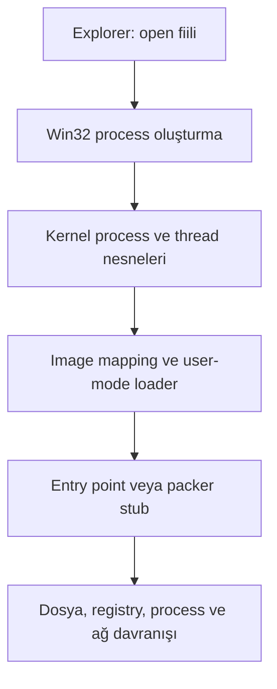

Dolayısıyla asıl sorumuz “malware ne yaptı?” kadar “Windows bu davranışın gerçekleşebilmesi için hangi nesneleri ve geçişleri üretti?” olmalı. İkinci soruyu sormadan birincisine verilen cevap eksik kalır.

## 2. Analiz

Eski C2 alan adları yeniden kaydedilebilir, loader yeni bir payload alabilir veya örnek DGA üzerinden başka bir hedefe gidebilir. En güvenli tasarım, Windows analiz VM'inin yalnızca kontrollü bir servis simülatörüne ulaşabildiği internal/host-only ağdır.

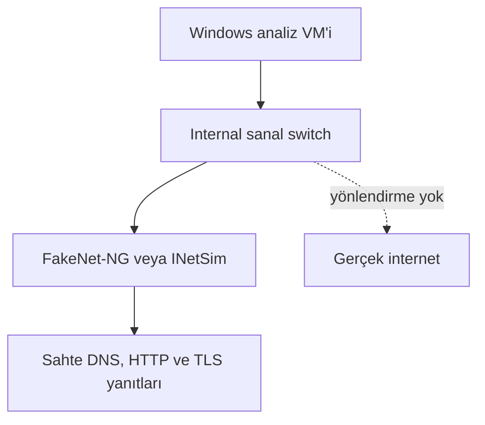

Laboratuvarı çalıştırmadan önce şu kontrolleri yaparım:

1. Temiz Windows snapshot'ı alınır; dönüş noktası sample VM'e kopyalanmadan önce oluşturulur.
2. Shared folders, clipboard sync, drag-and-drop, USB passthrough ve host disk mount özellikleri kapatılır.
3. Sanal NIC `bridged` veya gerçek internete çıkan `NAT` yerine internal/host-only moda alınır.
4. FakeNet-NG Windows üzerinde ya da INetSim ayrı bir Linux/REMnux VM üzerinde sahte DNS ve uygulama servisleri sunar.
5. Capture başlamadan process listesi, çalışan servisler, autoruns noktaları ve ağ tablosu baseline olarak kaydedilir.
6. Sample hash'leri VM dışında doğrulanır; çalıştırmadan hemen önce ve analiz sonunda tekrar hesaplanır.

| Katman | Araç | Bu analizdeki rolü |
| --- | --- | --- |
| PE ön inceleme | PE-bear, Detect It Easy (DIE) | Header, section, imports, entropy, packer işaretleri |
| Statik tersine mühendislik | Ghidra veya IDA | Control flow, cross-reference, string çözme, API çağrı bağlamı |
| Runtime debugging | x32dbg | PE32 örneğin instruction akışı, API breakpoint'leri, unpacking geçişi |
| Process görünürlüğü | Process Explorer | Parent-child ilişkisi, token, integrity level, yüklü DLL'ler, handle'lar |
| Sistem davranışı | Process Monitor | File system, registry, process/thread ve image load olayları |
| Ağ | Wireshark | DNS, TCP ve HTTP akışının paket seviyesinde doğrulanması |
| Kontrollü internet | FakeNet-NG veya INetSim | C2 kapalı olsa bile DNS/HTTP davranışının ortaya çıkarılması |
| Kalıcı telemetri | Sysmon ve ETW/WPR | Olayların savunma tarafındaki karşılığı ve yüksek çözünürlüklü zaman çizgisi |

Bu örnek PE32/x86 olduğu için x64dbg paketinin **x32dbg** ön yüzü kullanılmalı. 64 bit Windows üzerinde sample büyük olasılıkla WOW64 altında koşacaktır; bu ayrıntı, syscall geçişini ve iki ayrı mimariye ait loader yapılarının görünmesini doğrudan etkiler.

## 3. İncelenecek Malware Örneğinin Tanıtılması

Merkezde Amadey ailesine ait, yayımlanmış raporda `amadey.exe` olarak yeniden adlandırılan bir örnek var. Dosyanın orijinal adı `ObjectHolderListEnumerator.exe`. Amadey ailesi 2018'de ortaya çıkan; sistemi profilleyen, C2'den görev alan ve ikincil payload/plugin indirebilen modüler bir Windows botnet/loader ailesi. [Malpedia](https://malpedia.caad.fkie.fraunhofer.de/details/win.amadey) aileyi Ekim 2018 civarına tarihlendiriyor; bu dosya için raporun YARA metadata'sında `first_seen` değeri 28 Haziran 2021 olarak verilmiş.

Örnek değerleri [Siber Vatan Amadey Teknik Analiz Raporu](https://www.sibervatan.org/raporlar/dosya/a24b74fb-ef90-439c-ac5f-a4510787d027.pdf) üzerinden alınmıştır:

| Alan | Değer |
| --- | --- |
| Filename | `ObjectHolderListEnumerator.exe` — analiz adı: `amadey.exe` |
| File size | Kaynak raporda yayımlanmamış; sample dosyasından ölçülmeli |
| MD5 | `6072ffa2e78a14d9655d436e2178e5c3` |
| SHA-1 | `554ce2c13d5eff616a56b66790ca251a2f65789e` |
| SHA-256 | `5ed5d0c108109f37d683bbfc81db522a2622269d9ef339b963cab3ca3974a517` |
| Compile timestamp | Kaynak raporda yayımlanmamış; PE header'dan okunmalı ve sahte olabileceği ayrıca değerlendirilmelidir |
| Architecture | PE32, Intel x86 — 32 bit |
| Sign status | Kaynak raporda yayımlanmamış; Authenticode doğrulaması sample üzerinde yapılmalı |
| Malware family | Amadey |
| Sample first seen | `2021-06-28` — rapordaki YARA metadata'sı |
| Family first observed | Ekim 2018 civarı |

Bu örneği seçmemin sebebi “en gelişmiş malware” olması değil. Tam tersine, tek bir binary içinde Windows'un çok farklı alt sistemlerine dokunması: packer/obfuscation, anti-debugging, Temp altına self-copy, process bağlamı değişikliği iddiası, WinINet trafiği ve HTTP POST. Böyle bir örnek Windows loader ile malware davranışı arasındaki sınırı açık biçimde göstermeye elverişli.

<Info>
  Dosya boyutu, compile timestamp ve imza durumu için sayı uydurulmadı. Aynı şekilde raporda düz metin olarak verilmeyen OEP adresi, section entropy değerleri ve exact POST body de “ölçülmüş bulgu” gibi sunulmayacak. Profesyonel analizde `unknown`, yanlış kesinlikten daha değerlidir.
</Info>

## Aşama I — Dosya Henüz Çalıştırılmadı

### 4. PE Dosyasının Anatomisi — Windows Bu Dosyayı Nasıl Görüyor?

PE, yalnızca makine kodunun paketlendiği bir kutu değildir. Loader'a “hangi mimari için üretildim, adres alanında ne kadar yer istiyorum, ilk kod nerede, hangi DLL'lere ihtiyacım var, section'ların disk ve bellek düzeni nasıl?” sorularının cevabını veren sözleşmedir. Microsoft'un [PE/COFF biçim tanımı](https://learn.microsoft.com/en-us/windows/win32/debug/pe-format), dosyanın temel katmanlarını şöyle tarif eder:

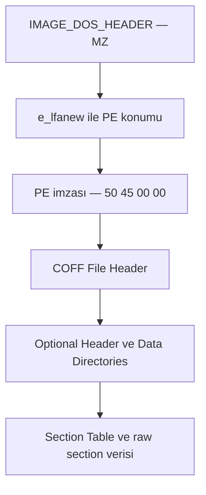

`IMAGE_DOS_HEADER` içindeki `e_lfanew`, PE imzasının dosya offset'ini gösterir. Ardından gelen COFF header makine tipini, section sayısını ve karakteristik bayraklarını taşır. “Optional Header” adı yanıltıcıdır: executable image için pratikte zorunludur. Entry point, image base, alignments, image size ve import/relocation/TLS gibi dizinlerin RVA'ları burada bulunur.

Analizde özellikle şu alanlara bakarım:

| Alan | Teknik anlamı | Analiz değeri |
| --- | --- | --- |
| `AddressOfEntryPoint` | Image base'e göre entry point RVA'sı | Loader'ın ilk teslim edeceği uygulama adresi; packed dosyada çoğu zaman stub'ı gösterir |
| `ImageBase` | Tercih edilen load base | Runtime base ile kıyaslanarak relocation delta hesaplanır |
| `SectionAlignment` | Section'ların memory image içindeki hizası | RVA düzenini ve `SizeOfImage` hesabını etkiler |
| `FileAlignment` | Raw section verisinin diskteki hizası | File offset ile RVA'nın neden aynı olmadığını açıklar |
| `SizeOfImage` | Header ve section'larla image'ın sanal boyutu | Disk boyutundan farklı olabilir; map edilecek adres aralığını tarif eder |
| `DllCharacteristics` | ASLR, DEP/NX, CFG gibi seçenekler | Exploit mitigation ve loader davranışı hakkında ipucu verir |

RVA ile file offset'i birbirine karıştırmak, PE analizinin klasik hatasıdır. Bir byte'ın diskteki yeri section'ın `PointerToRawData` alanıyla, memory içindeki yeri ise `VirtualAddress` alanıyla ilişkilidir. Basitleştirilmiş dönüşüm şudur:

```text
file_offset = section.PointerToRawData
            + (RVA - section.VirtualAddress)
```

Bu formül yalnızca ilgili RVA gerçekten o section'a düşüyorsa kullanılmalıdır. Header bölgesi ve `VirtualSize`/`SizeOfRawData` farkları ayrıca ele alınır.

Standart section isimleri kesin bir kural değildir; yalnızca gelenektir:

| Section | Genellikle ne taşır? | Beklenen koruma |
| --- | --- | --- |
| `.text` | Executable code | `R-X` |
| `.rdata` | Salt okunur sabitler, stringler, import verileri | `R--` |
| `.data` | Başlatılmış global veriler | `RW-` |
| `.rsrc` | Icon, dialog, version bilgisi, gömülü blob'lar | `R--` |
| `.reloc` | Base relocation blokları | `R--` veya discardable |

Bir packer bu isimleri koruyabilir, değiştirebilir veya tüm payload'ı alakasız isimli tek bir section'a koyabilir. Bu yüzden “`.text` var, dosya normal” veya “section adı garip, dosya kesin zararlı” denemez. İsim değil; raw/virtual boyut, entropy, karakteristikler ve runtime davranış birlikte okunur.

### 5. Entropy, Packing ve Obfuscation Kontrolü

Byte dağılımının Shannon entropy değeri, bir section içindeki verinin ne kadar tekdüze veya rastlantısal göründüğünü ölçer:

```text
H(X) = -Σ p(x) · log₂ p(x)
```

Byte tabanlı ölçümde teorik aralık `0–8 bit/byte` değeridir. Uzun bir sıfır dizisinin entropy'si düşüktür; sıkıştırılmış ya da şifrelenmiş veri genellikle 8'e yaklaşır. Fakat “7.2 üstü malware” gibi evrensel bir eşik yoktur. JPEG/PNG kaynakları, sıkıştırılmış installer verileri ve meşru kriptografik tablolar da yüksek entropy üretir.

Bu örnek için rapor iki önemli bulgu yayımlıyor:

- DIE, dosyayı packed/obfuscated olarak değerlendiriyor.
- `.text`, `.rdata`, `.data`, `.reloc` ve `.rsrc` dışında üç ek şifreli section bulunduğu belirtiliyor.

Ham entropy değerleri verilmediği için burada sayı üretmek doğru olmaz. Yine de şu kombinasyon güçlü bir packer hipotezi oluşturur:

| Gözlem | Tek başına anlamı | Birlikte okunduğunda |
| --- | --- | --- |
| Yüksek section entropy | Sıkıştırma veya şifreleme olabilir | Küçük import seti ve runtime write/execute ile packer olasılığı artar |
| Anormal section isimleri | Custom toolchain olabilir | Entry point aynı section'da ve section RWX ise şüphe güçlenir |
| `VirtualSize` ile `SizeOfRawData` arasında büyük fark | BSS, unpack hedefi veya padding olabilir | Runtime'da aynı bölgeye yoğun yazma varsa unpack buffer olabilir |
| `RWE/RWX` section | JIT veya packer olabilir | Normal masaüstü yazılımında seyrektir; entry point ile kesişiyorsa incelenmelidir |
| Çok az import | Statik link, dynamic API resolution veya packer olabilir | `LoadLibrary`/`GetProcAddress` ve PEB yürüyüşüyle birlikte anlamlıdır |

Entropy yalnızca “nereye bakmalıyım?” sorusunu cevaplar. Packing'i doğrulayan an, debugger'da stub'ın bir bölgeyi yazması/decode etmesi, sayfa korumasını executable yapması ve kontrolü yeni koda devretmesidir.

### 6. Import Table — Malware Daha Çalışmadan Bize Ne Söylüyor?

Import table kesin bir davranış listesi değil, binary'nin loader'dan çözmesini istediği bağımlılıkların listesidir. Bir API'nin import edilmesi çağrıldığı anlamına gelmez; çağrılan API de import table'da görünmeyebilir. Malware isimleri runtime'da çözebilir, ordinal kullanabilir, API hash uygulayabilir veya syscall'a doğrudan gidebilir.

Raporun yayımladığı API listesi bu örnek için daha güvenli bir başlangıç sunuyor:

| Raporlanan API | Olası yetenek | Kanıt seviyesi |
| --- | --- | --- |
| `CreateFileA/W`, `WriteFile`, `ReadFile` | Dosya üretme, okuma ve yazma | Dosya davranışı ayrıca dinamik analizde görülmüş |
| `CreateProcessA`, `SuspendThread`, `ResumeThread` | Yeni process/thread kontrolü | Injection veya hollowing için ipucu; tek başına kanıt değil |
| `VirtualAlloc` | Kendi process'inde sanal bellek ayırma | Unpacking/decode buffer olabilir; remote allocation değildir |
| `CreateMutexW` | Tek instance kontrolü | Mutex adı raporda yayımlanmamış |
| `IsDebuggerPresent` | Basit anti-debug kontrolü | Raporun anti-debug bölümünde ayrıca gözlemlenmiş |
| `SetUnhandledExceptionFilter` | Exception yönlendirme | Anti-debug olabilir; normal crash handling de olabilir |
| `Sleep` | Gecikme veya normal bekleme | Süre ve bağlam görülmeden evasion denemez |
| `InternetOpenA`, `InternetConnectA`, `HttpOpenRequestA` | WinINet oturumu ve HTTP isteği | Ağ trafiğiyle doğrulanmış |
| `InternetWriteFile`, `InternetReadFile`, `InternetOpenUrlW` | Request body gönderme, yanıt/payload alma | POST ve C2 davranışıyla uyumlu |
| `GdipSaveImageToFile` | Görüntü dosyası üretme | Screenshot yeteneği hipotezi; çağrı argümanları görülmeli |

Kullanışlı bir ayrım şudur:

- `VirtualAlloc` yalnızca çağıran process'in adres alanını hedefler.
- `VirtualAllocEx` başka bir process'in adres alanını hedefleyebilir.
- `WriteProcessMemory` remote process'e veri yazar.
- `CreateRemoteThread` remote address space içinde thread oluşturur.

Son üç API, kullanıcının verdiği genel injection zincirinde yer alabilir; fakat yayımlanmış sample API listesinde `WriteProcessMemory` ve `CreateRemoteThread` yok. Bu nedenle bu örneğin o klasik zinciri kullandığını varsaymak yerine debugger, ETW/Sysmon ve process access telemetrisiyle yöntem belirlenmeli.

### 7. Strings Analizi — Binary'nin Bıraktığı Küçük İpuçları

Strings çıktısı bazen bir binary'nin en konuşkan kısmıdır, bazen de packer yüzünden neredeyse tamamen sessizdir. ASCII ve UTF-16LE birlikte aranmalı; yalnızca `strings.exe` çıktısına değil, length-prefixed dizilere, stack üzerinde kurulan stringlere ve decode sonrası memory'ye de bakılmalıdır.

Bu örnek için yayımlanmış artefact'lar şunlar:

| Artefact | Tür | Analitik anlamı |
| --- | --- | --- |
| `fc76a6c9ea` | Temp altında klasör adı | Self-copy/drop konumu |
| `drbux.exe` | Dropped executable | Ana örneğin yeniden oluşturulmuş kopyası olarak raporlanmış |
| `15212987719733412987` | Uzantısız/binary dosya adı | `CreateFile` → `WriteFile` → close zinciriyle oluşturulmuş |
| `GdiPlus.dll` için WinSxS yolu | Sistem dosya yolu | Dosya metadata sorgusuyla ilişkilendirilmiş |
| Üç Windows cache `.db` yolu | Yerel veri kaynağı | Sistem bilgisinin okunmasıyla ilişkilendirilmiş |
| `194.58.103.2.cloudvps.regruhosting[.]ru` | Defanged C2/host artefact'ı | Process Monitor'da bağlantı girişimi |
| `bethdahleen[.]com` | Defanged domain | İkinci bağlantı hedefi |

String analizi sırasında her bulguya en az üç soru sorarım:

1. Bu string dosyada düz metin mi, decode edilmiş memory'de mi bulundu?
2. Stringe cross-reference var mı; hangi basic block'ta kullanılıyor?
3. Runtime'da gerçekten bir API argümanına dönüşüyor mu?

Bir domain stringinin varlığı network IOC üretir, fakat bağlantı kanıtı üretmez. Bir Run key stringinin bulunması persistence hipotezi üretir, fakat registry yazımı kanıtlamaz. String, davranışın kendisi değil; davranışa götüren adrestir.

## Aşama II — Kullanıcı Malware'i Çalıştırıyor

### 8. Çift Tıklamadan `CreateProcess`'e

Explorer bir `.exe` için varsayılan `open` fiilini işletir. Shell katmanı file association, App Paths, çalışma dizini, UAC gereksinimi ve başka kabuk davranışlarını değerlendirir. Basitleştirilmiş zincir şu şekilde gösterilebilir:

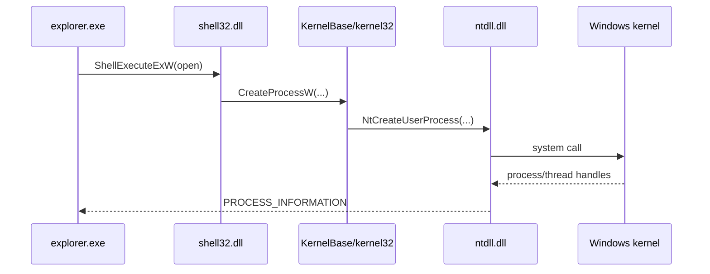

Bu bir **kavramsal** call path'tir, ABI garantisi değildir. Windows build'ine, elevation isteğine, application compatibility katmanına ve shell association davranışına göre ara fonksiyonlar değişebilir. Microsoft'un [UAC mimarisi](https://learn.microsoft.com/en-us/windows/security/application-security/application-control/user-account-control/architecture), elevation gerektiğinde ShellExecute yolunun Application Information service ile ayrılabileceğini gösterir.

`ShellExecuteExW`, “bu dosya türüyle ne yapılır?” sorusunu çözen yüksek seviye Shell API'sidir. `CreateProcessW` ise doğrudan bir executable image ve command line ile yeni process ve primary thread oluşturma sözleşmesini sunar. Microsoft'un [CreateProcessW belgelerine](https://learn.microsoft.com/en-us/windows/win32/api/processthreadsapi/nf-processthreadsapi-createprocessw) göre yeni process varsayılan durumda çağıran process'in güvenlik bağlamında başlar.

Modern Windows'ta `kernel32.dll` içindeki birçok export'un uygulaması `KernelBase.dll` tarafına yönlendirilir. Ardından desteklenen Win32 sözleşmesinin altındaki Native API kullanılır. `NtCreateUserProcess` uygulama geliştiricileri için kararlı, belgelenmiş bir Win32 API değildir; malware analistinin call stack'te gördüğü iç katmandır.

### 9. User Mode'dan Kernel Mode'a Geçiş

`CreateProcessW` bir syscall instruction'ı değildir. Parametre doğrulama, command line ayrıştırma, environment ve attribute hazırlığı gibi önemli işlerin bir bölümü user mode'da yapılır. Native API sınırında `ntdll.dll` devreye girer. Microsoft, user-mode uygulamaların Native System Services girişlerine `ntdll.dll` üzerinden ulaştığını ve bu entry point'lerin çağrıyı kernel mode'a trapped system call'a çevirdiğini [Windows driver belgelerinde](https://learn.microsoft.com/en-us/windows-hardware/drivers/kernel/libraries-and-headers) açıklar.

| Katman | Tipik örnek | Görevi |
| --- | --- | --- |
| Win32 API | `CreateProcessW` | Desteklenen, yüksek seviyeli uygulama sözleşmesi |
| Native API | `NtCreateUserProcess` | NT executive ile konuşan düşük seviye arayüz |
| Syscall stub | `ntdll.dll` içindeki mimariye özel stub | System service number ve mode transition hazırlığı |
| Kernel dispatcher | System service dispatch | İlgili kernel routine'e yönlendirme |
| Executive/manager'lar | Process Manager, Memory Manager, Object Manager, Security Reference Monitor | Process'in gerçek nesnelerini ve kaynaklarını kurma |

Ring 3 kodu kendi başına kernel yapılarına erişemez. CPU `syscall`/mimariye özgü geçiş mekanizmasıyla daha ayrıcalıklı yürütme bağlamına geçer; kernel user pointer'larını güvenilmeyen girdi olarak doğrular. [Nt ve Zw servisleri hakkındaki Microsoft açıklaması](https://learn.microsoft.com/en-us/windows-hardware/drivers/kernel/using-nt-and-zw-versions-of-the-native-system-services-routines), user mode'dan gelen parametrelerin probe ve validation sürecinden geçtiğini vurgular.

Bu sample x86 olduğu için önemli bir nüans var. 32 bit Windows üzerindeki geçiş ile 64 bit Windows'ta WOW64 altındaki geçiş aynı değildir. WOW64 senaryosunda x86 `ntdll` çağrısı 64 bit syscall dünyasına bir compatibility katmanı üzerinden ulaşır. Dolayısıyla “EAX'e syscall numarası yazdı, `syscall` çalıştı” cümlesi x64 stub için öğretici olabilir; PE32 örneğin gerçek yolunu tek başına tarif etmez. Ayrıca system service number'lar Windows build'leri arasında sabit değildir. Hard-code edilmiş syscall tablosunu evrensel kabul etmek hatalıdır.

### 10. Windows Kernel Yeni Process'i Nasıl Oluşturuyor?

Kernel'e geçildiğinde “process” tek bir struct'tan ibaret değildir. Object Manager tarafından yönetilen process ve thread nesneleri, Memory Manager'ın adres alanı yapıları, Security Reference Monitor'ün token kontrolleri ve handle'larla erişilen kernel nesneleri birlikte kurulur.

Microsoft, `EPROCESS` ve `ETHREAD` yapılarını açıkça **opaque** olarak tanımlar; layout sürüme göre değişebilir. [Windows Kernel Opaque Structures](https://learn.microsoft.com/en-us/windows-hardware/drivers/kernel/eprocess) dokümanına göre `EPROCESS` kernel'in process nesnesi, `ETHREAD` ise thread nesnesidir.

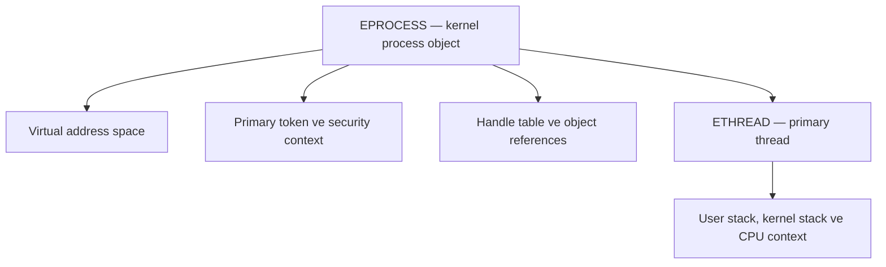

| Kavram | Ne ifade eder? | Analizde nerede görünür? |
| --- | --- | --- |
| `EPROCESS` | Process'in kernel temsili | Kernel WinDbg `!process`, EDR kernel telemetrisi |
| `ETHREAD` | Bir thread'in kernel temsili | Thread start/stop ETW, kernel debugger |
| PID / Client ID | Process'i kullanıcı araçlarında tanımlayan kimlik | Procmon, Sysmon, Event Log, debugger |
| Handle table | File, key, event, mutex, process gibi nesnelere process-local referanslar | Process Explorer handles, Object Manager callback telemetrisi |
| Primary access token | Kullanıcı SID'leri, group'lar, privilege'lar ve integrity bilgisi | Process Explorer Security, token API'leri |
| Virtual address space | Image, DLL, heap, stack ve memory-mapped bölgelerin adres düzlemi | x32dbg Memory Map, VMMap, WinDbg |

PID bir kernel pointer değildir. Handle da global bir nesne adresi değildir; process'in handle table'ındaki, access mask ile sınırlandırılmış bir girişe işaret eder. Malware başka bir process'i `OpenProcess` ile açtığında aslında “PID'ye sahip olmaktan” çok, hedef process nesnesine belirli haklarla bir handle edinmeye çalışır.

Birincil thread oluşturulsa bile CPU doğrudan malware'in OEP'ine bırakılmaz. Başlangıç bağlamı önce user-mode loader başlangıç yoluna gider; çağrı zincirinde build'e göre `ntdll!LdrInitializeThunk` ve `RtlUserThreadStart` gibi rutinler görülür. Loader işi bittikten sonra kontrol executable entry point'e teslim edilir.

## Aşama III — Windows PE Loader Devreye Giriyor

### 11. Malware RAM'e Nasıl Map Ediliyor?

“Windows EXE'yi RAM'e kopyalar” cümlesi giriş seviyesinde iş görür, fakat teknik olarak yetersizdir. Executable file için bir image section nesnesi kurulur ve bu image process'in sanal adres alanına map edilir. `SEC_IMAGE`, file mapping'in executable image olduğunu belirtir; sayfa korumaları genel bir `PAGE_READWRITE` tercihiyle değil PE image'ın kendi section özellikleriyle belirlenir. Bu davranış [CreateFileMapping `SEC_IMAGE` belgelerinde](https://learn.microsoft.com/en-us/windows/win32/api/winbase/nf-winbase-createfilemappinga) açıklanır.

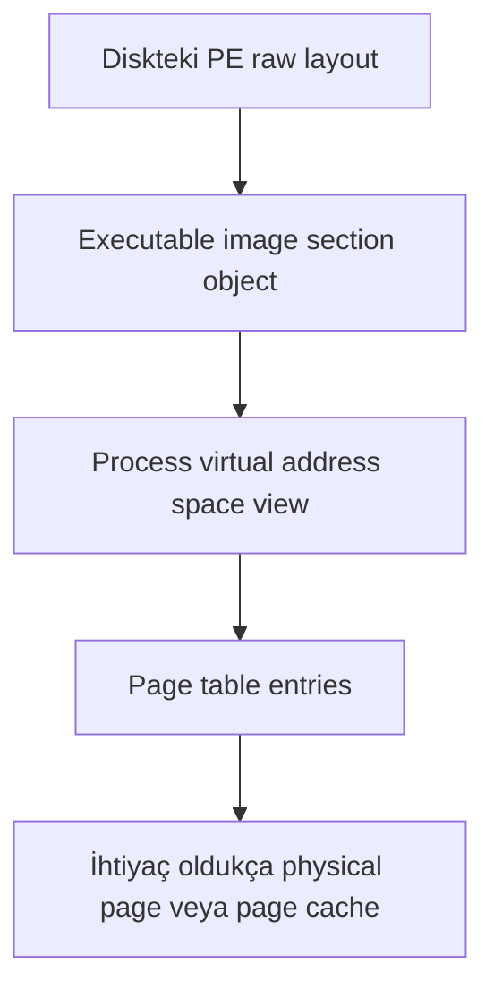

Buradaki kritik sonuçlar şunlar:

- File offset ile virtual address aynı değildir.
- Tüm image'ın bütün byte'ları ilk anda fiziksel RAM'e gelmek zorunda değildir; demand paging devrededir.
- Aynı DLL'nin salt okunur executable sayfaları birden fazla process arasında fiziksel olarak paylaşılabilir.
- Process bir copy-on-write sayfayı değiştirdiğinde kendisine özel bir fiziksel kopya oluşabilir.
- Section'ın memory koruması `.text` için executable/read, `.data` için read/write gibi PE karakteristiklerinden türetilir.

Packed malware bu normal loader mekanizmasıyla önce **packer image'ını** map ettirir. Daha sonra stub kendi runtime buffer'larını ayırır, payload'ı decode eder ve kontrolü yeni bölgeye taşır. Windows başlangıçta diskte bulunmayan “unpacked gerçek image”ı otomatik olarak tanımaz; o bölge çoğu zaman private committed memory olarak görünür.

### 12. Virtual Memory — Malware Gerçekte Nerede Yaşıyor?

Her user-mode process'in kendine ait sanal adres alanı vardır. Aynı virtual address iki farklı process'te tamamen farklı fiziksel sayfalara gidebilir. Microsoft'un [Virtual Address Spaces](https://learn.microsoft.com/en-us/windows-hardware/drivers/gettingstarted/virtual-address-spaces) açıklaması, process izolasyonunun temelini bu eşlemeye dayandırır.

```text
User Space — amadey.exe process'i
│
├── Mapped image: amadey.exe / packer stub
├── Mapped image: ntdll.dll
├── Mapped image: kernel32.dll / KernelBase.dll
├── Mapped image: user32.dll, advapi32.dll, wininet.dll ...
├── Process heap ve ek heap'ler
├── Primary thread stack'i ve diğer thread stack'leri
├── PEB ve process parameters
├── Her thread için TEB/TLS alanı
├── Memory-mapped files
└── Private allocations: VirtualAlloc/unpack buffer'ları
```

32 bit bir process'in teorik adres alanı `2^32` byte'tır. Bunun kullanıcıya açık bölümü işletim sistemi, boot seçenekleri ve `LARGE_ADDRESS_AWARE` bayrağına göre değişir. 64 bit Windows'ta WOW64 altında çalışan, large-address-aware olmayan tipik bir x86 process çoğunlukla 2 GB user-mode alana sahiptir; large-address-aware x86 image daha geniş alan görebilir. Bu yüzden “x86 her zaman tam 4 GB kullanır” da “x86 yalnızca 2 GB'tır” da bağlamsız söylendiğinde eksiktir.

Sanal bir sayfanın üç temel state'i vardır: free, reserved ve committed. `VirtualAlloc` önce bir adres aralığını reserve edebilir, sonra sayfaları commit edebilir. Commit, fiziksel RAM'in o anda mutlaka bağlandığı anlamına gelmez; ilk erişime kadar actual page materialization gecikebilir. Microsoft'un [VirtualAlloc belgeleri](https://learn.microsoft.com/en-us/windows/win32/api/memoryapi/nf-memoryapi-virtualalloc) bu ayrımı açıkça yapar.

Malware analizi açısından memory bölgesinin dört özelliği özellikle değerlidir:

1. **Type:** `MEM_IMAGE`, `MEM_MAPPED` veya `MEM_PRIVATE`.
2. **State:** reserved/committed.
3. **Protection:** `R`, `RW`, `RX`, `RWX`, guard vb.
4. **Backing:** Diskte hangi file'a bağlı olduğu veya private olması.

Unpacked code'un `MEM_PRIVATE + RX/RWX` bir bölgeye taşınması, mapped image içindeki normal `.text` yürütmesinden farklı bir iz bırakır.

### 13. PEB ve TEB — Malware'in Windows Hakkındaki Bilgi Kaynağı

PEB, user-mode process'in loader ve process başlangıcıyla ilgili kritik state'ini taşır. TEB ise thread'e özgü state'i tanımlar. Bunlar kernel'in `EPROCESS/ETHREAD` nesneleri değildir; user address space içinde bulunan ve user-mode kod tarafından okunabilen yapılardır.

| PEB alanı/kavramı | Analitik anlamı |
| --- | --- |
| `ImageBaseAddress` | Ana executable image'ın load base'i |
| `Ldr` | Yüklü modüller ve loader listelerine açılan kapı |
| `ProcessParameters` | Image path, command line, environment ve current directory gibi başlangıç verileri |
| `BeingDebugged` | Basit debugger var/yok göstergesi |
| Process heap referansları | Allocation ve runtime veri yapıları için başlangıç noktaları |

| TEB alanı/kavramı | Analitik anlamı |
| --- | --- |
| Thread stack sınırları | Stack base/limit ve exception bağlamı |
| PEB pointer'ı | Thread'den process environment'a geçiş |
| Last error / status | Win32 ve NT hata state'i |
| TLS slots | Thread-local veriler ve callback'lerle ilişkili state |

Microsoft, [PEB](https://learn.microsoft.com/en-us/windows/win32/api/winternl/ns-winternl-peb) yapısındaki `BeingDebugged` alanını belgeler; fakat yapının internal olduğunu ve layout'un değişebileceğini de özellikle belirtir. [TEB belgeleri](https://learn.microsoft.com/en-us/windows/win32/api/winternl/ns-winternl-teb) de aynı sürüm bağımlılığı uyarısını taşır.

Mimari seviyede x86 kod genellikle TEB'e `FS` segmenti, x64 kod ise `GS` segmenti üzerinden ulaşır. Sık görülen kalıplar x86 için `FS:[0x30]`, x64 için `GS:[0x60]` üzerinden PEB pointer'ını almaktır. Fakat WOW64'ta 32 ve 64 bit dünyalara ait paralel yapıların bulunabileceği unutulmamalı.

Malware neden PEB okur?

- Import bırakmadan yüklü DLL base adreslerini bulabilir.
- `kernel32.dll`/`ntdll.dll` export table'larını kendi koduyla gezebilir.
- API isimlerini hashleyerek manuel resolution yapabilir.
- `BeingDebugged` ile basit anti-debug kontrolü gerçekleştirebilir.
- Command line, image path veya environment üzerinden sandbox ipuçları arayabilir.

Bu yüzden disassembly'de `fs:`/`gs:` segment erişimi görmek önemlidir; fakat her segment erişimi zararlı değildir. Compiler runtime'ları, exception handling ve thread-local storage da aynı yapıları meşru biçimde kullanır.

### 14. DLL'ler Nasıl Yükleniyor?

Loader PE'nin Import Directory'sini okuyarak her `IMAGE_IMPORT_DESCRIPTOR` için gerekli DLL'yi bulur ve process'e map eder. Ana executable'ın tipik bağımlılıkları `ntdll.dll`, `kernel32.dll`, `KernelBase.dll`, `advapi32.dll`, `user32.dll` ve ağ gerekiyorsa `wininet.dll`/`winhttp.dll` olabilir.

DLL yükleme iki ana biçimde görünür:

- **Implicit import:** DLL ve fonksiyonlar PE import table'da kayıtlıdır; loader process başlangıcında çözer.
- **Explicit/dynamic load:** Kod `LoadLibrary*` ile modülü, `GetProcAddress` ile export'u runtime'da ister.

Microsoft'un [LoadLibrary belgelerine](https://learn.microsoft.com/en-us/windows/win32/api/libloaderapi/nf-libloaderapi-loadlibrarya) göre DLL process address space'e yüklenir ve gerekirse `DllMain(DLL_PROCESS_ATTACH)` çağrılır. Ancak modern Windows'ta çözüm her zaman “import edilen isimdeki DLL içinde son adres” kadar basit değildir. API Set şeması logical contract adlarını host DLL'lere yönlendirebilir; export forwarder bir fonksiyonu `kernel32` isminden `KernelBase` uygulamasına aktarabilir.

Rapor bu örneğin runtime sırasında `wininet.dll`, `GdiPlus.dll`, `shell32.dll`, `user32.dll` ve başka modülleri yüklediğini belirtiyor. Bu listeyi davranışla bağlamak gerekir: `wininet.dll` C2 zinciriyle, `GdiPlus.dll` ise görüntü işleme API'leriyle uyumludur. Yine de yalnızca DLL load görmek, içindeki belirli fonksiyonun çağrıldığını kanıtlamaz.

### 15. Import Address Table Nasıl Dolduruluyor?

Compiler bir dış fonksiyonun runtime adresini bilemez. Onun yerine call/jump instruction'ını IAT slot'una yöneltir. Loader ilgili export'u bulunca gerçek virtual address'i o slota yazar.

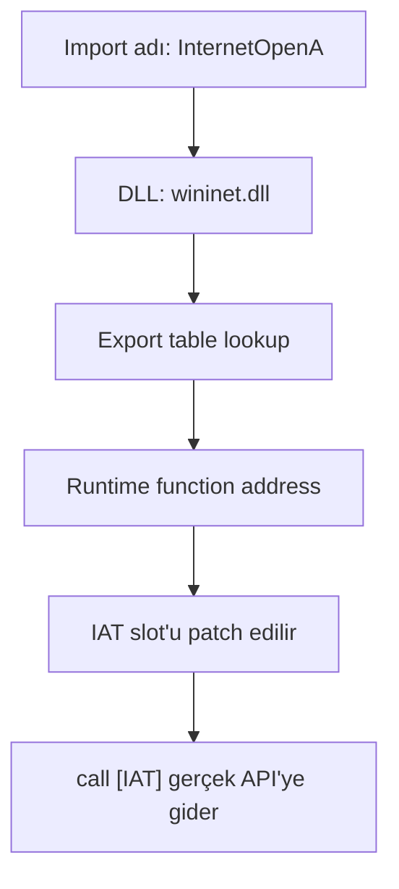

Kabaca akış şöyledir:

1. Loader import descriptor'dan DLL adını okur.
2. Modül henüz yoksa map eder ve bağımlılıklarını çözer.
3. Import thunk'tan fonksiyon adı veya ordinal alınır.
4. Export directory ve olası forwarder/API Set yönlendirmesi çözülür.
5. Son adres IAT slot'una yazılır.
6. Loader geçici olarak writable yaptığı IAT sayfalarını uygun korumaya geri çevirir.

Bir packer unpack sonrası kendi IAT'sini kurabilir. Bu durumda disk üzerindeki import table birkaç loader API'sinden ibaretken memory'de onlarca gerçek API address'i oluşur. Import reconstruction tam olarak bu yüzden unpacking'in ayrılmaz parçasıdır.

### 16. ASLR ve Base Relocation

PE header'daki `ImageBase`, image'ın tercih ettiği adrestir; söz verilmiş adres değildir. Bu aralık doluysa veya ASLR image'ı randomize ediyorsa loader başka bir load base seçer. Aradaki fark relocation delta'dır:

```text
delta = ActualLoadBase - PreferredImageBase
fixed_address = original_absolute_address + delta
```

`.reloc` section'ındaki base relocation table, sayfa RVA'sı ve o sayfadaki relocation entry'lerinden oluşan bloklar taşır. Bu sample x86 olduğundan tipik absolute fixup türü `IMAGE_REL_BASED_HIGHLOW` olur; x64 image'larda `IMAGE_REL_BASED_DIR64` görülür. Microsoft'un [Exploit Protection ASLR açıklaması](https://learn.microsoft.com/en-us/defender-endpoint/exploit-protection-reference), relocation tablosunun image tercih edilen base'e yüklenemediğinde mutlak referansları düzeltmek için kullanıldığını açıklar.

Debugger'da adresler her çalıştırmada değiştiğinde değişmeyen şeyi kaydetmek gerekir: raw VA değil, `module_base + RVA`. Örneğin breakpoint notunu `0x75A41230` diye yazmak yerine `amadey.exe+0x1230` şeklinde tutmak yeniden üretilebilir analiz sağlar.

Relocation table'ın varlığı ASLR'ın gerçekten etkin olduğu anlamına tek başına gelmez; `DYNAMIC_BASE` gibi `DllCharacteristics` bayrakları ve runtime load base birlikte incelenir. Benzer şekilde relocation table'ın kaldırılması da otomatik olarak malware göstergesi değildir; fakat image tercih edilen base'e yüklenemezse çalışabilirliği etkiler.

### 17. TLS Callback — Entry Point'ten Önce Çalışan Kod

PE TLS Directory, thread-local verinin yanında callback pointer dizisi taşıyabilir. Loader, uygulamanın normal entry point'ine geçmeden önce TLS callback'lerini çalıştırabilir. Malware analistinin “entry point'e breakpoint koydum, ilk kodu yakalarım” varsayımı bu nedenle her zaman doğru değildir.

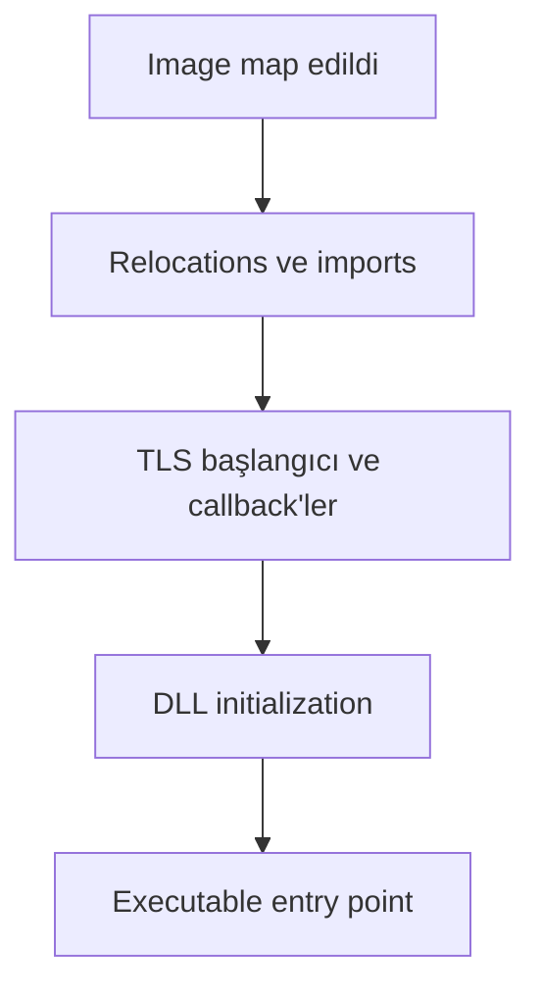

TLS callback içinde şunlar yapılabilir:

- `PEB.BeingDebugged` veya başka debugger kontrolleri,
- environment/VM kontrolü,
- string decode,
- unpack buffer hazırlığı,
- exception handler kurulumu,
- asıl entry point'i hiç çalıştırmadan process sonlandırma.

TLS Directory'nin varlığı malware kanıtı değildir; C/C\+\+ runtime ve meşru uygulamalar TLS kullanır. Şüpheli olan, callback'in davranışı ve entry point'ten önce oluşturduğu state'tir. PE-bear'da TLS callback RVA'ları çıkarılmalı, x32dbg'de bu adreslere module-relative breakpoint konulmalı ve ilk OEP breakpoint'inden önce tetiklenip tetiklenmediği kaydedilmelidir.

## Aşama IV — İlk Malware Talimatı Çalışıyor

### 18. Entry Point — CPU Malware Kodunu Çalıştırmaya Başlıyor

`AddressOfEntryPoint` bir RVA'dır. Runtime virtual address şu şekilde hesaplanır:

```text
EntryPointVA = RuntimeImageBase + AddressOfEntryPoint
```

PE32 image'ın tercih edilen base'i örneğin `0x00400000`, entry point RVA'sı `0x00001230` olsaydı ve image tercih edilen base'e yüklenseydi VA `0x00401230` olurdu. ASLR sonucu runtime base `0x00670000` ise aynı RVA `0x00671230` adresine taşınır.

Bu Amadey örneğinin gerçek `ImageBase` ve `AddressOfEntryPoint` değerleri kaynak raporda yayımlanmadığı için burada örneğe ait sahte bir adres vermiyorum. Gerçek laboratuvarda süreç şudur:

1. PE-bear'da Optional Header'dan `AddressOfEntryPoint` kaydedilir.
2. x32dbg Modules görünümünden runtime module base alınır.
3. İkisi toplanır ve module-relative breakpoint konur.
4. Breakpoint geldiğinde EIP, stack top, memory region type/protection ve call stack kaydedilir.

Packed örnekte bu adres çoğu zaman **original entry point (OEP)** değil, packer stub entry point'idir. Stub decode işlemini bitirip gerçek payload'a atladığında bulunan adres “gerçek OEP” adayıdır. OEP doğrulaması, yalnızca bir `jmp` hedefini görmekle değil; normal code yoğunluğu, anlamlı imports, stabil control flow ve ikinci çalıştırmada yeniden üretimle yapılır.

### 19. Assembly Seviyesinde İlk Talimatlar

<Warning>
  Kaynak raporun erişilebilir metni exact OEP disassembly'sini yayımlamıyor. Aşağıdaki 15 instruction bu hash'ten transkribe edilmiş gibi sunulamaz; raporda görülen `IsDebuggerPresent` ve `VirtualAlloc` davranışlarının debugger'da nasıl okunacağını göstermek için hazırlanmış temsili bir x86 stub'dır.
</Warning>

```asm
push ebp
mov  ebp, esp
sub  esp, 20h
call dword ptr [IsDebuggerPresent]
test eax, eax
jne  short analysis_detected
push 40h
push 3000h
push 20000h
push 0
call dword ptr [VirtualAlloc]
test eax, eax
je   short abort_path
mov  edi, eax
call decode_stage
jmp  edi
```

Bu küçük parça bile CPU seviyesinde çok şey söyler:

| Instruction | Register/stack etkisi | Analistin okuması |
| --- | --- | --- |
| `push ebp` | Eski frame pointer stack'e gider | Fonksiyon prologue başlangıcı olabilir |
| `mov ebp, esp` | Yeni stack frame tabanı kurulur | Local variable ve argüman erişimi kolaylaşır |
| `sub esp, 20h` | Stack'te 32 byte local alan ayrılır | Compiler-generated frame veya geçici buffer |
| `call [IsDebuggerPresent]` | Return address stack'e yazılır, API'ye geçilir | EAX dönüş değeri taşır |
| `test eax, eax` | EAX değişmeden ZF güncellenir | Sıfır/non-zero kontrolü |
| `jne analysis_detected` | ZF=0 ise branch | Debugger görüldüğünde ayrı path |
| Dört `push` | x86 stdcall argümanları sağdan sola hazırlanır | `VirtualAlloc(NULL, 0x20000, 0x3000, 0x40)` biçimi |
| `call [VirtualAlloc]` | Yeni region adresi EAX'e döner | Allocate edilen bölgenin type/protection'ı ayrıca doğrulanır |
| `je abort_path` | Allocation başarısızsa branch | Error path |
| `mov edi, eax` | Base address daha kalıcı register'a alınır | Sonraki write/decode hedefi olabilir |
| `call decode_stage` | Decode fonksiyonuna geçilir | Buffer'a yazılan byte'lar izlenir |
| `jmp edi` | Kontrol allocated bölgeye devredilir | Unpacking transition/OEP adayı |

Burada en değerli an son satırdır. `EDI` gerçekten `MEM_PRIVATE` ve executable bir bölgeyi gösteriyorsa; aynı bölge biraz önce yazılmışsa; instruction entropy'si artık normal code'a benziyorsa packer stub'dan payload'a geçiş yakalanmış olabilir. Fakat `jmp edi` tek başına unpacking kanıtı değildir. JIT motorları ve meşru runtime'lar da dinamik code üretir; örnek bağlamı belirleyicidir.

## Aşama V — Malware Windows'u Tanımaya Başlıyor

### 20. System Discovery — “Ben Nerede Çalışıyorum?”

Malware için bilgisayar adı yalnızca istatistik değildir. C2 panelinde kurbanı tekilleştirmek, doğru mimariye payload seçmek, yönetici yetkisi gerektiren görevi göndermek, belirli dil/bölgeyi filtrelemek ve sandbox olasılığını puanlamak için kullanılır.

Amadey ailesinin farklı sürümlerinde işletim sistemi, kullanıcı, bilgisayar adı, domain, mimari, yönetici durumu ve kurulu güvenlik ürünü bilgileri toplandığı belgelenmiştir. İncelediğimiz rapor ayrıca üç Windows cache `.db` dosyasına erişildiğini ve bunların sistem bilgisiyle ilişkilendirildiğini belirtiyor. Fakat exact API-to-field eşlemesi yayımlanmadığı için aşağıdaki tablo sample sonucu değil, debugger'da doğrulanacak Windows API haritasıdır:

| Bilgi | Muhtemel Windows API/yapı | Doğrulama noktası |
| --- | --- | --- |
| Windows version/build | `RtlGetVersion`, `GetVersionEx*`, PEB alanları | Return structure; manifest etkisi not edilmeli |
| Hostname | `GetComputerNameW`, `GetComputerNameExW` | Output buffer ve C2 builder cross-reference'i |
| Username | `GetUserNameW`, token query | Output buffer; service/account bağlamı |
| CPU/mimari | `GetNativeSystemInfo`, `IsWow64Process2`, CPUID | x86 sample ile native OS mimarisi ayrılmalı |
| RAM | `GlobalMemoryStatusEx` | `ullTotalPhys` ve threshold branch'i |
| Locale | `GetUserDefaultLocaleName`, `GetLocaleInfoEx` | Dil/bölge filtresiyle ilişkili branch |
| Keyboard layout | `GetKeyboardLayoutList` | Layout ID listesi ve sonraki karşılaştırma |
| Domain/workgroup | `GetComputerNameExW`, `NetWkstaGetInfo` | C2 alanına taşınan Unicode string |
| Admin/elevation | `CheckTokenMembership`, `GetTokenInformation` | TokenElevation/Integrity ve boolean'a dönüşüm |
| Güvenlik ürünü | WMI, Security Center, registry veya servis taraması | Hangi kaynaktan okunduğu ve ürün-id dönüşümü |

`GetVersionEx` sonuçları manifest'e göre compatibility değeri döndürebildiğinden malware'ler bazen `RtlGetVersion` veya build number gibi daha düşük seviye kaynaklara gider. Benzer biçimde 32 bit process'in `SYSTEM_INFO` sonucu ile host'un native mimarisi farklı olabilir; WOW64 ayrımı yapılmadan `x86 machine` sonucu çıkarılamaz.

System discovery fonksiyonunu reverse ederken en verimli yöntem, her API'yi tek tek kovalamak değil, **C2 request builder**'dan geriye yürümektir. POST buffer'a eklenen alanların source register/pointer'ları izlenir; bu pointer'ların hangi toplama fonksiyonundan geldiği bulunur. Böylece yüzlerce system API çağrısı arasından gerçekten exfiltration'a giren veriler ayrılır.

### 21. API Resolution — Malware Neden API İsimlerini Saklıyor?

Import table savunmacıya çok erken bilgi verir. Bunu azaltmanın klasik yolu, API'leri runtime'da çözmektir. Malware zaten yüklenmiş modülleri PEB loader listelerinden bulur, hedef DLL'nin PE export directory'sini parse eder ve istediği export'un adresini hesaplar.

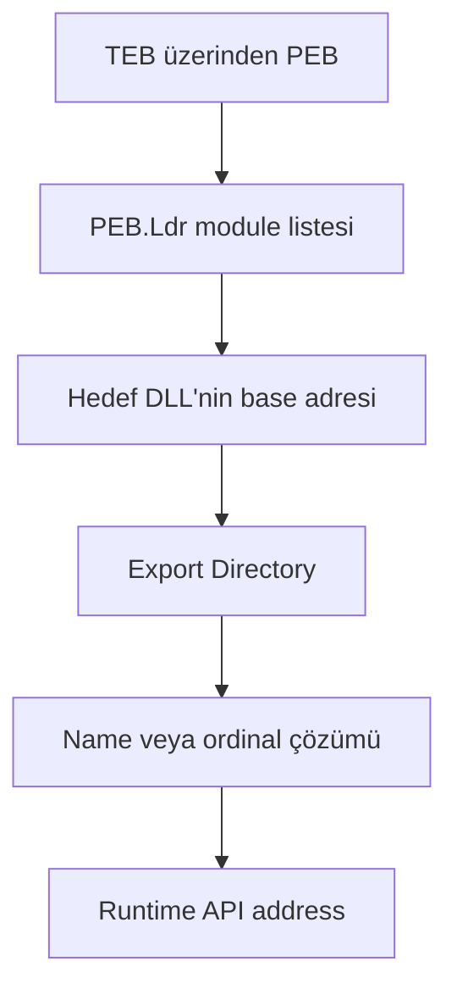

İşlem kavramsal olarak şöyledir:

1. TEB'den PEB pointer'ı alınır.
2. `PEB_LDR_DATA` içindeki module listeleri gezilir.
3. DLL adı case-insensitive karşılaştırılır veya hashlenir.
4. Module base'den DOS/NT header ve Export Data Directory bulunur.
5. `AddressOfNames`, `AddressOfNameOrdinals` ve `AddressOfFunctions` tabloları eşleştirilir.
6. Export forwarder varsa ikinci modül/isim çözülür.

API hashing bu akışta düz metin fonksiyon adını da kaldırır. Malware export isimlerine kendi hash fonksiyonunu uygulayıp hard-coded bir sabitle karşılaştırır. Analist açısından ipucu, export name table üzerinde tekrar eden loop, byte/character başına `ror/rol/xor/add` benzeri dönüşüm ve bir constant karşılaştırmasıdır.

Burada iki yanlış pozitif kaynağı var. Birincisi, meşru packer/protector ve oyun anti-cheat'leri de manuel resolution kullanabilir. İkincisi, compiler-generated loader kodu ile malware'in custom resolver'ı aynı şey değildir. Ayırt edici olan resolver'ın caller'ı, çözdüğü API seti ve sonraki davranıştır.

Bu Amadey raporunda `LoadLibraryA` ve `LoadLibraryExW` listeleniyor; ancak API hashing algoritması veya PEB tabanlı resolver bu hash için açıkça yayımlanmamış. Dolayısıyla ailede görülen obfuscation davranışını bu sample'a otomatik yapıştırmamak gerekir.

### 22. Mutex Kullanımı — “Bu Makineyi Daha Önce Enfekte Ettim mi?”

Named mutex, process'ler arası tek-instance kontrolünün ucuz yoludur. `CreateMutexW` aynı isimli nesne varsa mevcut nesneye bir handle döndürebilir; çağıran kod `GetLastError() == ERROR_ALREADY_EXISTS` sonucuyla ikinci kopya olduğunu anlayabilir.

Tipik karar akışı şöyledir:

```text
CreateMutexW(name)
        │
        ├── yeni nesne → execution devam eder
        └── ERROR_ALREADY_EXISTS → process çıkar veya uyur
```

Bu sample'ın API listesinde `CreateMutexW` bulunuyor, fakat mutex adı yayımlanmamış. Analiz sırasında yalnızca API breakpoint'i yeterli değildir; `lpName` argument'i çağrı anında okunmalı, namespace (`Local\`, `Global\` ya da adsız), security descriptor ve dönüşten sonraki `GetLastError` branch'i kaydedilmelidir.

Process Explorer'ın handle görünümü veya WinObj aynı mutex'i gösterebilir. Fakat mutex adına göre aile atfı kırılgandır: builder her build için rastgele ad üretebilir, aynı isim meşru yazılımda bulunabilir veya malware mutex oluşturmadan da tek instance kontrolü yapabilir.

## Aşama VI — Anti-Analysis Mekanizmaları

### 23. Anti-Debugging

Raporun sample-spesifik anti-debug bulguları şunlar: `IsDebuggerPresent`, `SetUnhandledExceptionFilter` ve `UnhandledExceptionFilter` API'leri listeleniyor; runtime'da `DbgBreakPoint`/exception davranışı ve thread resume akışı gözlemlendiği yazılıyor. Metindeki `DbgBreakPoint` açıklaması bazı ayrıntıları genelleştiriyor; bu nedenle exact control flow ancak debugger trace'iyle yeniden doğrulanmalı.

Anti-debug tekniklerini ayrı sinyaller olarak okumak daha sağlıklıdır:

| Teknik | Okunan sinyal | Analistin doğrulaması |
| --- | --- | --- |
| `IsDebuggerPresent` | Çağıran process'in debug state'i | Return sonrası EAX ve branch hedefi |
| `CheckRemoteDebuggerPresent` | Bir process handle'ı için debugger durumu | Output boolean ve handle'ın hangi process'e ait olduğu |
| `PEB.BeingDebugged` | PEB içindeki byte | Segment access ve offset; sürüm/mimari bağlamı |
| `NtQueryInformationProcess` | `ProcessDebugPort` gibi info class'lar | `ProcessInformationClass` ve output buffer |
| Exception tabanlı kontrol | Debugger'ın exception'ı tüketme/iletme davranışı | First-chance/second-chance exception sırası |
| Timing kontrolü | İki timestamp arasındaki beklenmedik fark | `QueryPerformanceCounter`, `GetTickCount64`, `RDTSC` çevresi |
| Software breakpoint kontrolü | Code byte'ında `0xCC` veya checksum farkı | Hangi region'ın tarandığı; self-modifying code ayrımı |
| Hardware breakpoint kontrolü | Thread context debug register'ları | `GetThreadContext` flags ve DR0–DR7 kullanımı |

Microsoft'un [`NtQueryInformationProcess` belgeleri](https://learn.microsoft.com/en-us/windows/win32/api/winternl/nf-winternl-ntqueryinformationprocess), `ProcessDebugPort` için sıfır olmayan değerin Ring 3 debugger kontrolünü gösterebildiğini belirtir. Aynı belge bu Native API'nin değişebileceği uyarısını da taşır.

Exception tabanlı kontrolde önemli olan “exception oluştu” değil, exception'ın kim tarafından ve hangi sırada işlendiğidir. Debugger first-chance exception'ı görür; analyst ayarına göre devam ettirir, tüketir veya uygulamaya iletir. Malware özel handler'ın çalışıp çalışmamasını bir oracle olarak kullanabilir. Bu yüzden x32dbg log'unda exception code, address, first/second chance durumu ve son handler path'i birlikte tutulmalıdır.

Anti-debug sinyali tespit edildiğinde hemen patch uygulamak analiz bütünlüğünü bozabilir. Önce davranış kaydedilir, temiz snapshot'tan debugger'sız kontrol koşusu alınır, ardından gerekiyorsa tek değişkenli deney yapılır. Aksi halde bypass sonrası görülen davranışın sample'a mı analistin müdahalesine mi ait olduğu belirsizleşir.

### 24. Anti-VM ve Sandbox Detection

VM tespiti çoğu zaman tek bir “VMware var mı?” kontrolü değildir; düşük güvenilirlikli birçok sinyalin puanlanmasıdır. Her sinyal gerçek kullanıcı sistemlerinde yanlış pozitif üretebilir.

| Sinyal sınıfı | Bakılan örnekler | Neden zayıf olabilir? |
| --- | --- | --- |
| Process/servis | Guest tools, analysis agent adları | Kurumsal endpoint'te meşru VM araçları bulunabilir |
| Registry/dosya | Hypervisor driver/service izleri | Golden image kalıntıları veya VDI normaldir |
| Firmware/BIOS | SMBIOS vendor/model stringleri | Bulut ve fiziksel OEM sistemleri çeşitlidir |
| MAC OUI | Sanallaştırma üreticisi prefix'leri | MAC kolayca değişir; kurumsal sanal ağlar yaygındır |
| CPU | CPUID hypervisor bit/vendor leaf | Hyper-V, VBS ve WSL nedeniyle fiziksel endpoint'te de görülebilir |
| Kaynak miktarı | Düşük RAM, tek CPU, küçük disk | Düşük donanımlı gerçek kullanıcı sistemleri vardır |
| Uptime | Çok kısa çalışma süresi | Normal reboot sonrası da kısadır |
| Kullanıcı aktivitesi | Mouse hareketi, recent files, browser history | Kiosk ve yeni kurulan makinelerde az olabilir |

Analiz VM'ini “gerçekçi göstermek” için sahte kişisel veri doldurmak yerine hangi check'in hangi karar branch'ini etkilediğini izlemek daha değerlidir. Runtime'da registry/file query'lerini Procmon'da filtreleyin; CPUID ve timing loop'larını debugger'da not edin; düşük kaynak koşulunda ve normal kaynak koşulunda iki kontrollü koşu karşılaştırın.

Bu hash için kaynak rapor açık bir anti-VM tekniği yayımlamıyor. Amadey ailesinde başka sürümlerde path/resource tabanlı anti-sandbox kontrolleri görülmüş olsa da bu sample'a ait kanıt olarak sunulmamalıdır.

### 25. Sleep ve Time-Based Evasion

`Sleep` import'u raporda bulunuyor. Fakat her `Sleep` anti-sandbox değildir. Thread senkronizasyonu, polling aralığı, retry backoff ve C2 beacon interval de aynı API'yi kullanabilir. Evasion demek için süre, çağrı bağlamı ve uyandıktan sonraki davranış gerekir.

Yaygın kalıplar:

- Uzun `Sleep`/`NtDelayExecution` ile kısa süreli sandbox penceresini aşmak,
- `GetTickCount64` veya uptime ile yeni boot edilmiş ortamı elemek,
- `QueryPerformanceCounter`/`RDTSC` ile single-step veya sleep acceleration farkını ölçmek,
- Birkaç farklı saat kaynağını karşılaştırarak hook/fast-forward tespit etmek,
- Kullanıcı input'u gelene kadar payload path'ini ertelemek.

Dinamik analizde “Sleep'e ulaştı” değil şu dörtlü kaydedilmelidir: requested interval, gerçek elapsed time, thread state ve wake-up sonrası next basic block. Sandbox zamanı hızlandırıyorsa sample'ın ikinci bir clock source ile bunu kontrol edip etmediği ayrıca izlenir.

## Aşama VII — Malware Kendini Sisteme Yerleştiriyor

### 26. Dosya Sistemi Üzerindeki Değişiklikler

Process Monitor, Win32 API adlarını değil çoğu zaman I/O Manager seviyesine daha yakın operasyonları gösterir. Kod `CreateFileW` çağırırken Procmon'da `CreateFile`, `QueryOpen`, `WriteFile`, `SetDispositionInformationFile` gibi satırlar görülebilir. Bu nedenle decompiler'daki tek API çağrısı Procmon'da birden fazla event üretir.

Raporlanan sample akışı şu artefact'ları içeriyor:

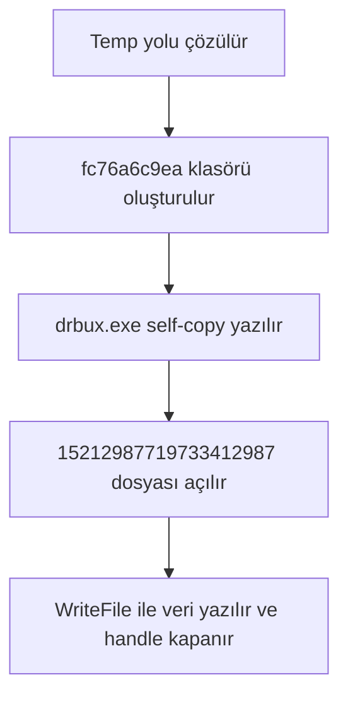

Rapor ayrıca debugger koşusunda masaüstünde `Unpacked.exe` üretildiğini ve bunun ana EXE ile aynı olduğunun gözlemlendiğini belirtiyor. “Aynı” sözcüğü burada hash-equal mı, içerik/işlev olarak aynı mı açık değil; gerçek analizde üç hash de karşılaştırılmalıdır.

Procmon görünümünde şu alanlar birlikte saklanır:

| Alan | Neden önemli? |
| --- | --- |
| Time of Day / relative time | Olayları thread ve ağ akışıyla sıralamak için |
| Process Name, PID, TID | İşlemi hangi execution context'in yaptığını görmek için |
| Operation | Create, write, rename, delete ve metadata işlemini ayırmak için |
| Path | `%TEMP%` gibi çözülmüş gerçek hedefi görmek için |
| Result | `SUCCESS`, `NAME NOT FOUND`, `ACCESS DENIED` ayrımı için |
| Detail | Desired access, disposition, offset, length gibi semantik ayrıntı için |
| Stack | Çağrının sample code'undan mı, loader/AV/başka bileşenden mi geldiğini ayırmak için |

`CreateFile` satırı yeni dosya yaratıldığı anlamına gelmeyebilir; `OPEN_EXISTING`, query veya directory probe için de görülebilir. `Disposition: Create/Overwrite` ve sonraki `WriteFile` olayları birlikte okunmalıdır. `CloseFile` davranışı da tek başına semantik değildir; önemli olan handle kapanmadan önce hangi byte aralıklarının yazıldığıdır.

### 27. Registry Üzerindeki Hareketler

Registry erişimini üç kategoriye ayırmak yararlıdır:

- **Discovery:** OS, locale, software veya policy bilgisi için `RegQueryValue`.
- **Configuration:** Malware'in kendi state/campaign verisini saklaması.
- **Persistence/defense evasion:** Autorun, service, task veya policy anahtarlarını değiştirmesi.

Win32 tarafındaki `RegOpenKeyExW`, `RegQueryValueExW`, `RegSetValueExW` çağrıları Native API'de `NtOpenKey`, `NtQueryValueKey`, `NtSetValueKey` biçiminde görülebilir. Procmon ise `RegOpenKey`, `RegQueryValue`, `RegSetValue` gibi operasyon adları sunar. Aynı davranışın üç isim katmanına sahip olması analiz notlarında sık karışır.

Bu sample raporu belirli bir Run/RunOnce key yazımı yayımlamıyor. Bu nedenle “Amadey registry persistence yaptı” cümlesi bu hash için kanıtlanmış değildir. Aranması gereken yerler şunlardır:

| Bölge | İncelenecek artefact |
| --- | --- |
| Run/RunOnce | Value name, data path, hive ve 32/64 bit registry view |
| User Shell Folders | Değiştirilen özel klasör değeri ve eski/yeni data |
| Services | Service image path, start type, service creation event'i |
| Task Scheduler | `TaskCache` registry kayıtları ile task XML eşleşmesi |
| Policies | Defender, proxy veya script policy değişiklikleri |

Registry snapshot diff'i, Procmon capture ve ilgili Event Log birlikte kullanılmalıdır. Yalnızca final state'e bakmak, malware'in yazıp sildiği geçici value'ları kaçırabilir; yalnızca Procmon'a bakmak ise son state'in gerçekten kalıcı olup olmadığını göstermez.

### 28. Persistence — Bilgisayar Yeniden Başlatıldığında Nasıl Geri Geliyor?

Bu örnek için rapor `%TEMP%\fc76a6c9ea\drbux.exe` kopyasını “kalıcılık” ile ilişkilendiriyor ve kodun `taskeng.exe` altında çalıştığını söylüyor. Burada analitik olarak iki ayrı iddia var:

1. Binary kendini başka bir konuma kopyaladı.
2. Bu kopyayı gelecekte yeniden başlatacak bir scheduler/autorun mekanizması kurdu.

Birinci iddia ikinciyi kanıtlamaz. Diskte kopya bırakmak **persistence hazırlığıdır**; yeniden başlatma trigger'ı görülmeden persistence tamamlanmış sayılmaz. Ayrıca eski Windows sürümlerindeki `taskeng.exe`, Task Scheduler engine/host process'idir; Task Scheduler service'in kendisiyle bire bir aynı kavram değildir.

Scheduled task hipotezini doğrulamak için şu kanıt zinciri gerekir:

```text
Task oluşturma çağrısı veya schtasks/comsvcs aktivitesi
        ↓
%SystemRoot%\System32\Tasks altında task tanımı
        ↓
TaskCache registry kayıtları
        ↓
TaskScheduler/Operational event'i
        ↓
Trigger sonrası drbux.exe process creation
```

Process tree'de `taskeng.exe → drbux.exe` görmek güçlü bir runtime kanıtıdır; fakat injection ile normal task launch birbirinden ayrılmalıdır. Eğer `drbux.exe` ayrı child process olarak başlıyorsa bu task execution olabilir. Eğer `taskeng.exe` image'ı altında private executable memory ve sample'a ait network/file davranışı varsa process injection hipotezi güçlenir.

Amadey ailesinin başka sürümlerinde Run/RunOnce, User Shell Folders ve scheduled tasks raporlanmıştır. [Splunk'ın Amadey araştırması](https://www.splunk.com/en_us/blog/security/amadey-threat-analysis-and-detections.html) bu aile düzeyi yöntemleri belgeliyor. Fakat farklı build'lerin davranışını bu 2021 hash'inin observed behavior'ı gibi yazmak doğru değildir.

## Aşama VIII — Process Injection Varsa İçeri Giriyoruz

### 29. Malware Neden Başka Bir Process'in İçine Giriyor?

Başka bir process bağlamında kod çalıştırmanın birkaç ayrı getirisi olabilir:

- Process listesinde malware dosya adı yerine tanıdık bir host adı görünür.
- Ağ bağlantısı ve file I/O host process'e atfedilebilir.
- Hedef process'in token ve erişebildiği kaynaklar kullanılabilir; ancak injection otomatik privilege escalation değildir.
- Basit parent/child veya image-path kuralları zorlanır.
- Orijinal loader process'i kapanırken payload yaşamaya devam edebilir.

“Trusted process altında çalışmak EDR'dan görünmez olmak” anlamına gelmez. Modern ürünler process access, remote memory allocation, cross-process write, thread start address, image/private memory farkı ve call stack telemetrisini ilişkilendirir. İyi bir EDR için injection bazen normal process execution'dan daha gürültülüdür.

Hedef seçimi de önemlidir. `explorer.exe`, `svchost.exe`, browser process'leri veya `taskeng.exe` aynı trust/yetki/ömür özelliklerine sahip değildir. Malware'in hedefi nasıl bulduğu, hangi access mask ile açtığı ve target bitness'in sample ile uyumu yöntemin parçasıdır.

### 30. Injection Zincirinin Windows API Seviyesinde Analizi

Klasik anlatı dört kutudan oluşur; gerçek analizde her ok için ayrı kanıt gerekir:

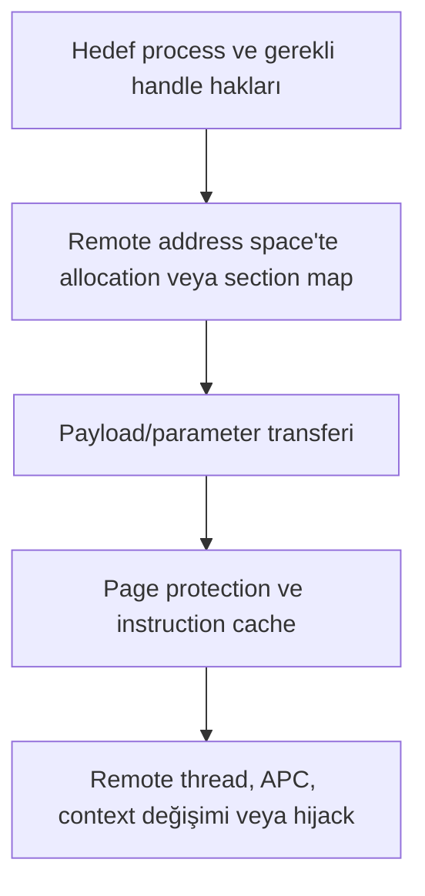

| Aşama | Klasik Win32 örneği | Native/alternatif iz | Telemetri |
| --- | --- | --- | --- |
| Hedefe erişim | `OpenProcess` | Existing/inherited/duplicated handle | Sysmon 10, Object Manager/EDR handle event'i |
| Allocation | `VirtualAllocEx` | `NtAllocateVirtualMemory`, shared section map | Remote private memory, protection değişimi |
| Yazma | `WriteProcessMemory` | `NtWriteVirtualMemory`, section-backed copy | Cross-process write, changed bytes |
| Çalıştırma | `CreateRemoteThread` | `NtCreateThreadEx`, APC, `SetThreadContext`, thread hijack | Sysmon 8, suspicious start address/context |

Microsoft'a göre `WriteProcessMemory`, hedef process handle'ında `PROCESS_VM_WRITE` ve `PROCESS_VM_OPERATION` hakları ister; [`CreateRemoteThread`](https://learn.microsoft.com/en-us/windows/win32/api/processthreadsapi/nf-processthreadsapi-createremotethread) ise ek olarak thread oluşturma ve query hakları gerektirir. Bu access mask'ler EDR telemetrisinde önemli bir bağlam üretir.

Bu Amadey sample'ı için kaynak rapor `taskeng.exe` içine injection iddiasında bulunuyor. Aynı rapor `CreateProcessA`, `SuspendThread`, `ResumeThread` ve `VirtualAlloc` API'lerini listeliyor; fakat `VirtualAllocEx`, `WriteProcessMemory`, `CreateRemoteThread`, `SetThreadContext` veya `NtUnmapViewOfSection` zincirini yayımlamıyor. Özellikle `VirtualAlloc`, remote değil çağıran process'te allocation yapar.

Bu durumda doğru sonuç “injection kesin” değil, “host context değişikliği raporlanmış; exact technique eksik”tir. Şunlar toplanmadan hollowing, remote-thread injection veya başka bir teknik adı verilmemelidir:

- Hedef process handle'ı ve granted access mask,
- Hangi PID'nin adres alanında yeni region oluştuğu,
- Region type/protection ve backing file,
- Byte'ların hangi API/stack üzerinden taşındığı,
- Yeni thread start address veya değiştirilen thread context,
- `taskeng.exe` içindeki network/file davranışının hangi TID'den geldiği.

Bu şüphecilik analizi zayıflatmaz; tam tersine iddiayı yeniden üretilebilir hale getirir.

## Aşama IX — C2 İletişimi Başlıyor

### 31. DNS Çözümlemesinden TCP Bağlantısına

Bir domain stringi doğrudan Ethernet frame'e dönüşmez. Uygulama katmanından NIC'e kadar birkaç ayrı state machine devreye girer:

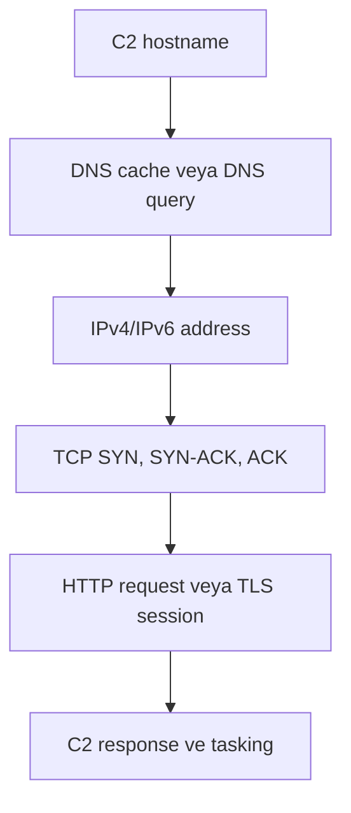

DNS çözümü local cache, hosts file, DNS Client service ve yapılandırılmış resolver'lar nedeniyle her koşuda wire üzerinde görünmeyebilir. “Wireshark'ta DNS yok, domain kullanılmadı” sonucu bu yüzden hatalı olabilir. Capture öncesi cache state'i kaydedilmeli; API breakpoint, ETW DNS event'i ve packet capture birlikte değerlendirilmelidir.

Rapor, sample'ın şu iki defanged hedefe ulaşmaya çalıştığını belirtiyor:

- `194.58.103.2.cloudvps.regruhosting[.]ru`
- `bethdahleen[.]com`

Sunucular aktif olmadığı için bağlantının tamamlanamadığı, buna karşın pcap'te POST girişiminin/encode edilmiş veri gönderme davranışının görüldüğü yazılmış. Burada DNS success, TCP connect ve HTTP send ayrı olaylardır; birinin görülmesi diğerlerinin başarıyla tamamlandığı anlamına gelmez.

### 32. Windows Network API'leri

Raporlanan API seti bu sample'ın **WinINet** kullandığını güçlü biçimde gösteriyor: `InternetOpenA`, `InternetConnectA`, `HttpOpenRequestA`, `InternetWriteFile`, `InternetReadFile` ve `InternetOpenUrlW`.

WinINet handle hiyerarşisi şöyledir:

```text
InternetOpenA              → session HINTERNET
  └─ InternetConnectA      → connection HINTERNET
       └─ HttpOpenRequestA → request HINTERNET
            ├─ HttpSendRequest / InternetWriteFile
            └─ InternetReadFile
```

`HttpOpenRequest` request metadata'sını ve header state'ini hazırlar; network send'in o satırda mutlaka gerçekleşmesi gerekmez. Microsoft'un [HttpOpenRequest belgeleri](https://learn.microsoft.com/en-us/windows/win32/api/wininet/nf-wininet-httpopenrequesta), request handle'ın gönderilecek HTTP header'larını taşıdığını açıklar.

| Stack | Tipik API'ler | Analiz karakteri |
| --- | --- | --- |
| WinINet | `InternetOpen`, `InternetConnect`, `HttpOpenRequest`, `HttpSendRequest` | Desktop/client uygulama davranışına yakın; proxy/cache ayarlarını kullanabilir |
| WinHTTP | `WinHttpOpen`, `WinHttpConnect`, `WinHttpOpenRequest`, `WinHttpSendRequest` | Service/back-end kullanımına uygun HTTP client stack |
| Winsock | `getaddrinfo`, `socket`, `connect`, `send`, `recv` | Protocol ayrıntısını malware daha doğrudan yönetir |
| DNS API | `DnsQuery*` | Explicit DNS çözümü; cache ve resolver davranışı ayrıca incelenir |

WinINet import'u HTTP semantiğini gösterir; TCP'nin altında yine Windows networking stack vardır. Winsock import'u görünmemesi “socket yok” anlamına gelmez, çünkü WinINet alt katmanları bunu malware adına kullanır.

### 33. Wireshark ile Paket Seviyesinde İnceleme

Kontrollü ağda capture, sample başlamadan birkaç saniye önce açılır. VM'nin IP/MAC bilgisi kaydedilir ve filtreler adım adım daraltılır:

| Amaç | Wireshark display filter |
| --- | --- |
| Sample VM trafiği | `ip.addr == <LAB_VM_IP>` |
| DNS sorgu/yanıtları | `dns` |
| Yeni TCP bağlantıları | `tcp.flags.syn == 1 && tcp.flags.ack == 0` |
| HTTP istekleri | `http.request` |
| POST istekleri | `http.request.method == "POST"` |
| Bir konuşmayı izlemek | `tcp.stream eq <N>` |
| Retransmission/reset | `tcp.analysis.retransmission or tcp.flags.reset == 1` |

Paket okuma sırası:

1. DNS query name, type ve response address kaydedilir.
2. SYN'in destination IP/port'u ve three-way handshake sonucu incelenir.
3. HTTP method, Host, URI, User-Agent, Content-Type ve Content-Length çıkarılır.
4. POST body binary mi, form-urlencoded mı, base64-benzeri mi değerlendirilir.
5. Server response varsa status, body ve indirilen object hashlenir.
6. Aynı TCP stream içindeki retry/redirect/task request'leri ayrılır.

C2 ölü olduğunda FakeNet-NG/INetSim DNS'i laboratuvar sunucusuna döndürerek request'in ilerlemesini sağlayabilir. Ancak sahte server response malware'in control flow'unu değiştireceği için verilen her yanıt deney notuna yazılmalıdır. “Sample bunu yaptı” ile “biz şu yanıtı verince bu branch'e gitti” aynı bulgu değildir.

HTTPS kullanılırsa packet capture çoğunlukla hostname/IP, certificate ve TLS metadata'sını verir; plaintext body'yi değil. Bu durumda request buffer, `InternetWriteFile`/`HttpSendRequest` öncesinde debugger veya API tracing ile alınmalı; packet capture yalnızca wire karşılığını doğrulamalıdır. Bu rapordaki örnek için açık HTTP POST davranışı belirtilmiştir.

### 34. C2 Request'in Reverse Engineering'i

Bu sample'ın exact POST body ve field delimiter'ları rapor metninde yayımlanmıyor. Aynı aileye ait daha yeni bir 3.83 örneğini inceleyen [Splunk araştırması](https://www.splunk.com/en_us/blog/security/amadey-threat-analysis-and-detections.html), aşağıdaki alanları belgeler. Bu tablo **aile düzeyi referanstır**, 2021 hash'inin paketi olarak sunulmamalıdır:

| Tag | Anlam | Örnek değer türü |
| --- | --- | --- |
| `id` | Compromised host/victim ID | Sayısal veya türetilmiş kimlik |
| `vs` | Amadey build version | Örneğin `3.83` |
| `sd` | Campaign/build ID | Kısa identifier |
| `os` | Windows sürüm kodu | Aile içi enum |
| `bi` | Sistem mimarisi | x86/x64 kodu |
| `ar` | Admin/elevation durumu | Boolean/enum |
| `pc` | Computer name | Hostname |
| `un` | User name | Hesap adı |
| `dm` | Domain name | Domain/workgroup |
| `av` | Güvenlik ürünü | Aile içi ürün kodu |
| `lv`, `og` | Tasking/protokol state'i | Build'e özgü değer |

POST buffer'ı reverse ederken ağdan koda doğru değil, koddan ağa doğru bir data-flow grafiği kurarım:

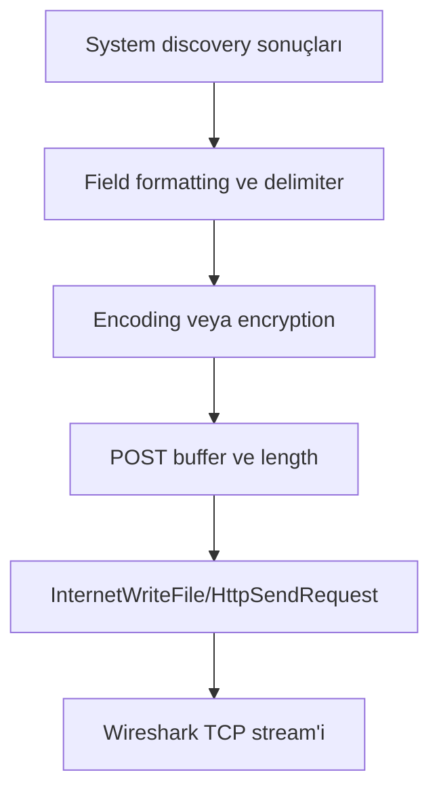

Debugger'da send API'sinin buffer pointer ve length argümanları kaydedilir. Buffer'ın memory write cross-reference'leri geriye izlenir. Her alanın builder'a eklendiği basic block bulunur. Decode edilmiş alan ile packet body byte-for-byte karşılaştırılır. Eğer encoded output değişiyorsa IV/nonce, victim-specific key veya random seed aranır.

Amadey'in başka sürümlerinde custom string encoding ve Base64 katmanları raporlanmıştır. [SonicWall'ın 3.83 analizi](https://www.sonicwall.com/blog/amadey-malware-has-improved-its-string-decoding-algorithm) API, C2 ve registry stringlerinin `.rdata` içinde encoded tutulduğunu belgeliyor. Fakat algoritma/build farkı nedeniyle bu sonucu geriye dönük biçimde bu 2021 sample'a atamak yerine, output alphabet, padding, decoded length ve decode routine'i sample üzerinde bulunmalıdır.

## Aşama X — Windows Açısından Bütün Olayı Tek Timeline'da Görmek

### 35. Process Monitor Timeline

Bir malware raporunun en güçlü sayfası bazen decompiler ekranı değil, ilk birkaç saniyenin iyi normalize edilmiş zaman çizgisidir. Process, file, registry ve network olayları aynı saat tabanında birleştiğinde davranışın sebep-sonuç ilişkisi görünür hale gelir.

Bu sample için yayımlanmış rapor raw `.PML`, `.PCAP` veya event timestamp'lerini paylaşmadığı için milisaniye değerleri uydurmak doğru olmaz. Aşağıdaki sıralama, laboratuvarda ölçülmesi gereken **capture şemasıdır**; `Δ` değerleri gerçek Procmon kaydından doldurulur:

```text
T+00.000  explorer.exe → amadey.exe Process Create
T+Δ1      Initial Image Load / ntdll / kernel32 / KernelBase
T+Δ2      wininet.dll ve diğer dependency load'ları
T+Δ3      IsDebuggerPresent / exception kontrol yolu
T+Δ4      CreateMutexW ve tek-instance kararı
T+Δ5      %TEMP%\fc76a6c9ea oluşturma
T+Δ6      drbux.exe CreateFile → WriteFile → Close
T+Δ7      15212987719733412987 dosyasına yazma
T+Δ8      taskeng.exe/process-context ilişkisi
T+Δ9      DNS/connection attempt
T+Δ10     HTTP POST veya retry
```

Bu listenin bir bölümü sample raporundaki bulgulara, bir bölümü Windows startup sırasında beklenen olaylara dayanır. Gerçek ordering ayrıca ölçülmelidir; örneğin mutex kontrolünün self-copy'den önce mi sonra mı gerçekleştiği kaynak metinden çıkarılamıyor.

Procmon capture'ı analiz ederken şu normalizasyonu uygularım:

1. Boot/background gürültüsü process name ve PID filtreleriyle ayrılır.
2. İlk sample PID'sinden descendant ve erişilen target PID'ler çıkarılır.
3. `Time of Day` yanında process start'a göre relative timestamp hesaplanır.
4. Aynı handle/path üzerinde ardışık query event'leri tek mantıksal operasyon altında gruplanır.
5. `NAME NOT FOUND` probe'ları ile başarılı create/write ayrılır.
6. Network event'leri pcap timestamp'leriyle, process event'leri Sysmon `ProcessGuid` ile bağlanır.
7. Her yüksek seviye iddia en az bir event satırı ve mümkünse call stack ile desteklenir.

Microsoft, [Process Monitor'ü](https://learn.microsoft.com/en-us/sysinternals/downloads/procmon) gerçek zamanlı file system, Registry ve process/thread activity gösteren bir araç olarak tanımlar. Bu görünürlük geniştir ama tam değildir: in-memory data flow, CPU instruction'ları ve bazı kernel/EDR sinyalleri için debugger ve ETW gerekir.

### 36. Sysmon / Windows Event Log Perspektifi

Procmon analyst workstation aracıdır; Sysmon ise doğru yapılandırıldığında olayları kalıcı Windows Event Log kayıtlarına dönüştürür. Microsoft'un [Sysmon dokümantasyonu](https://learn.microsoft.com/en-us/sysinternals/downloads/sysmon), process creation event'inin command line, hash ve domain genelinde korelasyona elverişli `ProcessGuid` taşıdığını belirtir.

| Sysmon Event ID | Olay | Bu analizde aranacak ilişki |
| --- | --- | --- |
| 1 | Process creation | `explorer.exe → amadey.exe`, olası `taskeng.exe/drbux.exe` ilişkileri, command line, hash |
| 3 | Network connection | Sample/host PID'den C2 IP ve port'a bağlantı |
| 7 | Image loaded | `wininet.dll`, `GdiPlus.dll` ve beklenmeyen modüller |
| 8 | CreateRemoteThread | Klasik remote-thread injection kanıtı varsa source/target ve start address |
| 10 | ProcessAccess | `amadey.exe` veya kopyanın `taskeng.exe` handle'ı açması, granted access |
| 11 | FileCreate | `fc76a6c9ea\drbux.exe` ve numeric dosya |
| 13 | Registry value set | Autorun/task/policy value değişikliği |
| 22 | DNS query | Defanged C2 host adları ve process correlation |
| 25 | Process tampering | Hollowing/process image manipulation benzeri tespit |

Event 3 ve Event 7 gibi gürültülü olaylar her yapılandırmada açık değildir; özellikle ImageLoad tüm modülleri kaydettiği için filtrelenmezse yüksek hacim üretir. “Logda yok” sonucundan önce ilgili event türünün capture sırasında etkin olduğu doğrulanmalıdır.

Native Windows logları da bağlam sağlar:

- Security Event 4688, Audit Process Creation etkinse yeni process ve isteğe bağlı command line bilgisi verir.
- Task Scheduler Operational logu task registration, action start ve completion akışını gösterebilir.
- Defender Operational logu sample detection/quarantine veya policy değişikliklerini gösterebilir.
- System logu service creation/start ve sürücü olaylarını destekleyebilir.

Korelasyon yalnızca PID ile yapılmamalı. PID'ler yeniden kullanılabilir. Sysmon `ProcessGuid`, process start time, image hash ve parent identity birlikte tutulduğunda daha güvenilir bir execution graph çıkar.

### 37. ETW — Windows'un Kendi Telemetrisi Bize Ne Söylüyor?

Event Tracing for Windows, user-mode ve kernel-mode provider'ların event üretmesini; controller'ın session açıp provider'ları etkinleştirmesini; consumer'ın event'leri gerçek zamanlı veya `.etl` dosyasından okumasını sağlayan altyapıdır. Microsoft, [ETW'yi](https://learn.microsoft.com/en-us/windows/win32/etw/about-event-tracing) verimli bir kernel-level tracing facility olarak tanımlar.

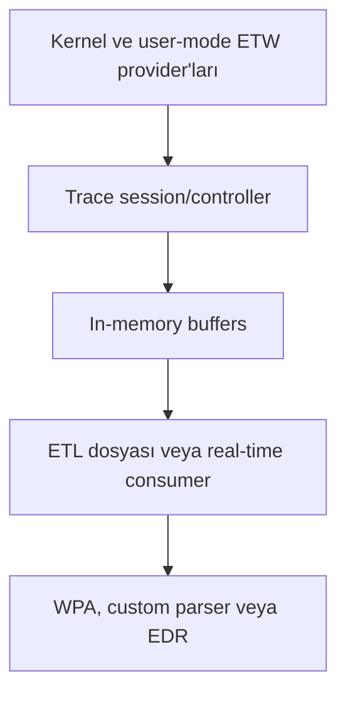

Malware analizi için yararlı event sınıfları:

| ETW görünümü | Sorulan soru |
| --- | --- |
| Process/thread lifecycle | Hangi process/thread ne zaman başladı, start address ve parent ilişkisi neydi? |
| Image load | Hangi DLL/image hangi base'e map edildi? |
| File I/O | Hangi thread hangi path'e hangi offset/length ile erişti? |
| Registry I/O | Hangi key/value okundu veya değiştirildi? |
| Networking | Bağlantı ve veri transferi hangi process/thread bağlamındaydı? |
| Memory/performance | Page fault, working set ve allocation davranışı nasıl değişti? |

[System Providers](https://learn.microsoft.com/en-us/windows/win32/etw/system-providers) içindeki System Process Provider process lifetime, image load ve thread event'leri sunar. Windows Performance Recorder (WPR) bu event'leri profil tabanlı kaydedebilir; Windows Performance Analyzer (WPA) `.etl` içinden grafik ve tablolar üretir.

ETW'nin avantajı yüksek çözünürlüktür; dezavantajı da aynı nedenle event hacmidir. Buffer boyutu/yazma hızı yetersizse event kaybı oluşabilir. Capture raporunda session profili, enabled provider/keyword'ler, clock type, lost event sayısı ve zaman senkronizasyonu yazılmalıdır. Aksi halde eksik trace, yanlış “olmadı” sonucuna dönüşebilir.

Bu sample'da ETW özellikle üç belirsizliği çözmeye yarar:

1. `taskeng.exe` ile ilişkinin normal process launch mı, handle access mi, thread/context değişikliği mi olduğu,
2. Unpacked kodun hangi thread ve memory region'da yürüdüğü,
3. C2 bağlantısının hangi PID/TID ve hangi image/private code bağlamından başlatıldığı.

## Aşama XI — Statik ve Dinamik Analizi Birleştirmek

### 38. Ghidra/IDA'daki Kod ile Procmon'daki Davranışı Eşleştirmek

İyi analiz “decompiler'da bu API var” veya “Procmon'da bu dosya var” demekle bitmez. Aynı olay iki taraftan bağlanır:

```text
Ghidra/IDA call site
    ↓ argument üretimi ve call graph
x32dbg return address / runtime arguments
    ↓
Procmon event + stack + path + result
    ↓
Diskte oluşan artefact'ın hash ve içeriği
```

Bu sample için uygulanabilecek eşleştirmeler:

| Statik bulgu | Runtime doğrulama | Sistem artefact'ı |
| --- | --- | --- |
| `CreateFileA/W` cross-reference'i | x32dbg'de filename pointer ve creation disposition | Procmon `CreateFile`; diskte `drbux.exe` |
| `WriteFile` caller'ı | Buffer pointer, length ve return value | Procmon write length; dropped file byte'ları |
| `CreateMutexW` | Mutex name ve `GetLastError` branch'i | Process handle listesi / Object Manager namespace |
| `IsDebuggerPresent` | EAX ve conditional branch | Debugger'lı/debugger'sız davranış farkı |
| `InternetConnectA` | Server name, port, handle chain | DNS/TCP event'i ve pcap |
| `InternetWriteFile` | Plain/encoded POST buffer | Wireshark body byte'ları |
| `VirtualAlloc` | Base, size, protection, caller | Memory map'te private region ve write/execute geçişi |

Örneğin decompiler `CreateFileW(path, ...)` gösteriyorsa `path` değişkeni tek başına yetmez. Runtime'da pointer'ın gerçek Unicode içeriği, file creation disposition, dönen handle, ardından o handle'a yapılan write'lar ve final file hash'i kaydedilir. Böylece “dosya açmaya çalıştı” ile “payload bıraktı” ayrılır.

Call site'i etiketlerken yalnızca API adı değil semantik rol yazılır: `CreateFileW_drop_self_copy`, `WriteFile_post_buffer`, `VirtualAlloc_unpack_region` gibi. Bu isimler kanıt güçlendikçe güncellenmelidir; ilk bakışta `unpack_region` denilen buffer daha sonra screenshot buffer çıkabilir.

### 39. x32dbg ile Runtime Davranışın Doğrulanması

Örnek PE32 olduğu için x32dbg kullanılmalı ve x86 calling convention dikkate alınmalıdır. API entry'sinde return address `[ESP]`, ilk stdcall argument'i `[ESP+4]` konumundadır. Fonksiyon dönüşünde `EAX`, boolean/handle/pointer gibi sonucu taşır.

| Breakpoint hedefi | Entry'de kaydedilecek veri | Return sonrası kaydedilecek veri |
| --- | --- | --- |
| `IsDebuggerPresent` | Caller/return address | `EAX` ve izlenen branch |
| `CreateFileA/W` | Path, desired access, creation disposition | File handle / error code |
| `WriteFile` | Handle, buffer, byte count | Yazılan byte sayısı ve buffer hash'i |
| `CreateProcessA` | Application, command line, creation flags | New PID/TID ve handle'lar |
| `VirtualAlloc` | Requested base, size, allocation type, protection | Region base ve Memory Map entry'si |
| `VirtualProtect` | Region, size, old/new protection | Başarı ve execution transition |
| `CreateMutexW` | Mutex adı, initial owner | Handle ve `ERROR_ALREADY_EXISTS` |
| `InternetConnectA` | Server name ve port | Connection handle |
| `HttpOpenRequestA` | Verb, object path, flags | Request handle |
| `InternetWriteFile` | Buffer ve length | Gönderilen byte sayısı |
| `InternetReadFile` | Destination buffer ve requested length | Response byte'ları |

Modern Windows'ta export forwarding nedeniyle breakpoint'in `kernel32` isminden `KernelBase` implementation'ına çözülmesi normaldir. Dynamic API resolution varsa import breakpoint'leri kaçabilir; bu durumda `ntdll` Native API sınırları ve memory execution breakpoint'leri ek görünürlük sağlar.

Her hit için şu minimal log formatı yeterince güçlüdür:

```text
timestamp | PID:TID | API | return-address (module+RVA)
arguments | result/GetLastError | related memory/path/handle
```

Debugger kullanımı sample davranışını değiştirebilir. Bu yüzden aynı snapshot'tan en az iki koşu alınır:

- **Gözlem koşusu:** Debugger yok; Procmon, Sysmon/ETW ve pcap açık.
- **Kontrollü debug koşusu:** API/OEP breakpoint'leri açık; aynı FakeNet yanıt profili kullanılır.

İki koşu karşılaştırıldığında yalnız debugger altında kaybolan network/file branch'leri anti-analysis göstergesine dönüşür. Tek debugger koşusundan “sample'ın normal davranışı” çıkarılamaz.

WOW64'ın 32→64 geçişi x32dbg'nin user-mode x86 görünümünün altında kalabilir. Kernel process nesneleri, cross-process access ve tam syscall bağlamı gerekiyorsa ETW, EDR telemetrisi veya ayrı kernel debugging oturumu kullanılmalıdır.

### 40. Unpacking — Diskteki Malware ile RAM'deki Malware Aynı mı?

Çoğu zaman aynı değildir. Diskteki sample packer stub ve encoded payload taşırken, RAM'de decoder'ın ürettiği daha büyük, farklı section/region düzenine ve yeniden kurulmuş API pointer'larına sahip kod bulunabilir.

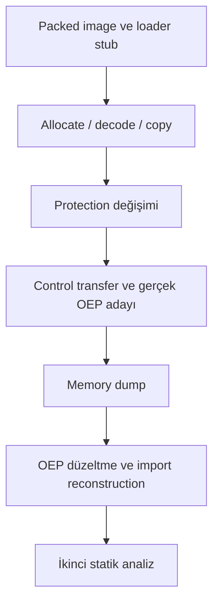

Pratik unpacking akışı:

1. Orijinal sample hash'leri ve PE metadata'sı kaydedilir.
2. Entry point/TLS callback'lerden başlanarak write edilen memory region'lar izlenir.
3. `VirtualAlloc`/`VirtualProtect` sonucu oluşan `MEM_PRIVATE` executable alanlar işaretlenir.
4. Stub'dan yeni region'a direct/indirect jump, return veya exception transferi aranır.
5. Yeni region'da normal fonksiyon prologue'ları, control-flow yoğunluğu, string/API kullanımı ve stabil execution doğrulanır.
6. Process o noktada durdurulur ve ilgili image/region dump edilir.
7. Runtime image base ve gerçek OEP dump metadata'sına uygulanır.
8. Resolved API address'lerinden import table/IAT Scylla benzeri bir araçla yeniden kurulur.
9. Dump yeniden açılır; section mapping, imports, strings ve decompiler sonucu kontrol edilir.
10. Orijinal dosya ile dump ayrı hash'lenir; dump'ın analist tarafından üretilmiş artefact olduğu raporda belirtilir.

Unpacking'in bittiğini gösteren tek bir sihirli instruction yoktur. Şu sinyaller birlikte aranır:

- Execution packer image'ın küçük stub'ından daha geniş bir code bölgesine taşınır.
- Bölge daha önce yazılmıştır ve artık executable'dır.
- API çağrıları/manuel resolver sonrası gerçek işlevler görünür.
- Control flow birkaç basic block'tan ibaret değildir; normal fonksiyon ağı oluşur.
- Stringler ve configuration artefact'ları plaintext veya çözülebilir hale gelir.
- İkinci çalıştırmada aynı module-relative geçiş yeniden üretilebilir.

Rapor, debugger sırasında `Unpacked.exe` adlı yeni bir EXE üretildiğini ve ana EXE ile aynı olduğunun düşünüldüğünü söylüyor. Bu ad dosyanın gerçekten unpacked olduğuna tek başına kanıt değildir. Original, `Unpacked.exe`, `drbux.exe` ve memory dump için size/hash/PE structure karşılaştırması yapılmalıdır. İsim, analistin veya sample'ın etiketi olabilir; içerik doğrulamayı hash ve yapı analizi yapar.

## Sonuç — “Çalıştı” Dediğimiz Şey Bir Olay Değil, Bir Zincir

Bir `.exe` dosyasına çift tıkladığımızda ilk gerçekleşen şey malware davranışı değildir. Önce Shell isteği çözer, Win32 process creation katmanı çalışır, Native API kernel'e geçer, `EPROCESS`/`ETHREAD` ve güvenlik bağlamı kurulur, executable image sanal adres alanına map edilir, imports ve relocations çözülür, TLS callback'leri çalışabilir ve CPU entry point'e ulaşır. Packed örnekte entry point bile gerçek payload değil, onu RAM'de kuran stub'dır.

Amadey örneği bu zincirin üzerine kendi izlerini bırakıyor: packed ve obfuscated PE, ek şifreli section'lar, anti-debug API'leri, Temp altında `drbux.exe` self-copy'si, numeric bir binary dosya, `taskeng.exe` bağlamı hakkında araştırılması gereken bir iddia ve WinINet üzerinden iki tarihsel C2 hedefine POST girişimi.

En önemli sonuç ise teknik bir API adı değil, kanıt disiplini:

- Import, niyet/kapasite ipucudur; gerçekleşmiş davranış değildir.
- String, artefact'tır; network veya registry olayı değildir.
- Self-copy, tek başına persistence değildir.
- Bir host process adı, tek başına injection tekniğini söylemez.
- Family behavior, aynı ailedeki her hash için sample evidence değildir.
- Raw timeline ve exact disassembly yoksa milisaniye veya instruction uydurulmaz.

Windows'un process, memory, loader, I/O ve network katmanlarını tek tek gördüğümüzde malware artık “karanlıkta çalışan bir EXE” olmaktan çıkar. Birbiriyle ilişkilendirilebilir kernel nesneleri, user-mode çağrılar, memory region'lar, file/registry artefact'ları ve paketlerden oluşan ölçülebilir bir olay zincirine dönüşür.

## IOC ve Analiz Özeti

<Warning>
  Aşağıdaki domain/host değerleri tarihsel IOC olarak defanged biçimde verilmiştir. Bir IOC'nin geçmişte zararlı olması güncel sahiplik veya bağlam hakkında tek başına hüküm vermez.
</Warning>

| Tür | Değer | Kaynak/yorum |
| --- | --- | --- |
| Original filename | `ObjectHolderListEnumerator.exe` | Sample raporu |
| Analysis filename | `amadey.exe` | Sample raporu |
| MD5 | `6072ffa2e78a14d9655d436e2178e5c3` | Sample raporu |
| SHA-1 | `554ce2c13d5eff616a56b66790ca251a2f65789e` | Sample raporu |
| SHA-256 | `5ed5d0c108109f37d683bbfc81db522a2622269d9ef339b963cab3ca3974a517` | Sample raporu |
| Dropped directory | `%LOCALAPPDATA%\Temp\fc76a6c9ea` | Sample raporu |
| Dropped executable | `drbux.exe` | Sample raporu |
| Dropped binary | `15212987719733412987` | Sample raporu |
| Host/domain | `194.58.103.2.cloudvps.regruhosting[.]ru` | Tarihsel bağlantı girişimi |
| Domain | `bethdahleen[.]com` | Tarihsel bağlantı girişimi |
| Architecture | PE32 / x86 | Sample raporu |
| Family | Amadey | Sample raporu |
